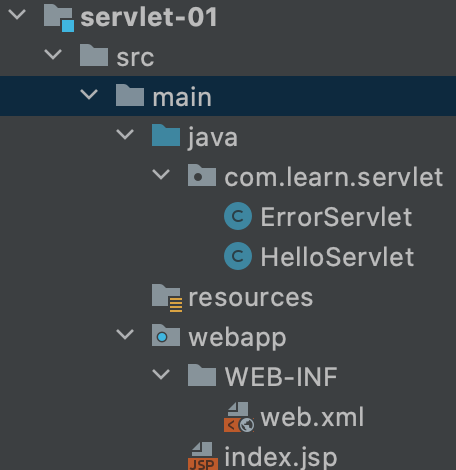
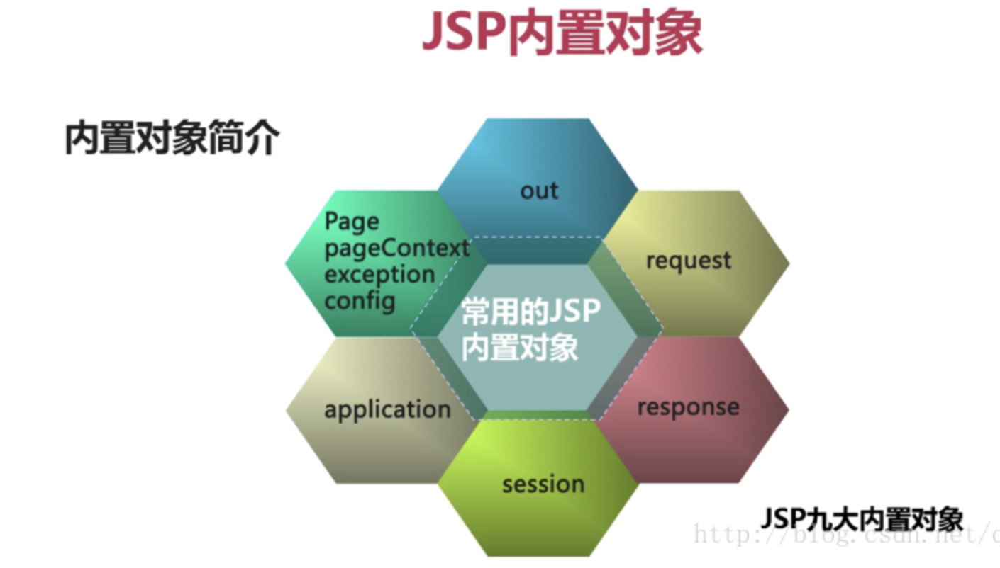
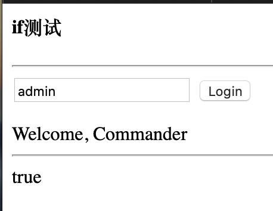
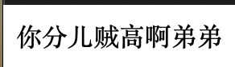
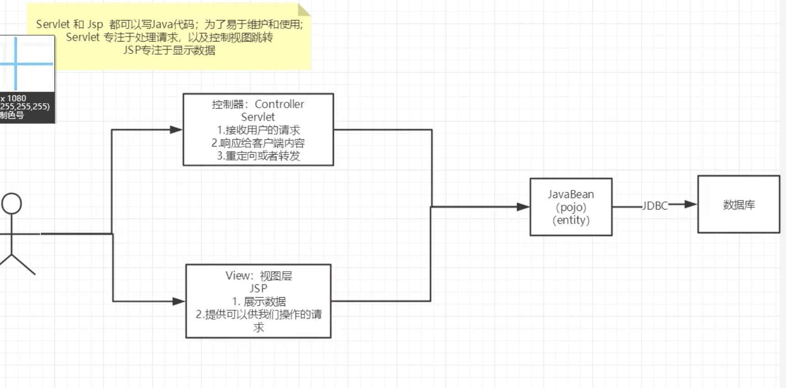
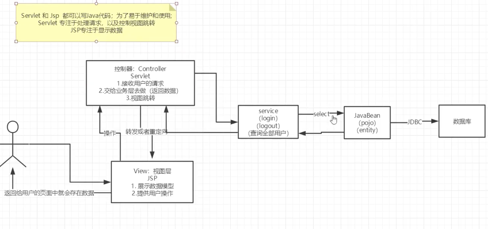
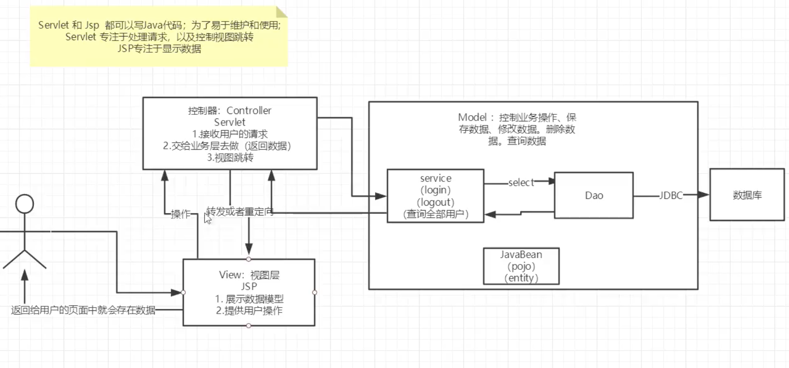

# 6 Servlet

Java *Servlet*的简称,称为小服务程序或服务连接器,用Java编写的服务器端程序。

## 6.1 导入maven坐标


## 6.2 第一个servlet

```xml
<dependency>
            <groupId>javax.servlet</groupId>
            <artifactId>javax.servlet-api</artifactId>
            <version>4.0.1</version>
            <scope>provided</scope>
        </dependency>

        <!-- https://mvnrepository.com/artifact/javax.servlet.jsp/javax.servlet.jsp-api -->
        <dependency>
            <groupId>javax.servlet.jsp</groupId>
            <artifactId>javax.servlet.jsp-api</artifactId>
            <version>2.3.3</version>
            <scope>provided</scope>
        </dependency>
```


**HelloServlet.java**

```java
public class HelloServlet extends HttpServlet {
    @Override
    protected void doGet(HttpServletRequest req, HttpServletResponse resp) throws ServletException, IOException {
//      ServletOutputStream outputStream = resp.getOutputStream();

        System.out.println("进入doGet方法了");
        // 响应流
        PrintWriter writer = resp.getWriter();
        writer.print("hello, Servlet");

    }

    @Override
    protected void doPost(HttpServletRequest req, HttpServletResponse resp) throws ServletException, IOException {
        doGet(req, resp);
    }
}
```

ErrorServlet.java

```java
public class ErrorServlet extends HttpServlet {

    @Override
    protected void doGet(HttpServletRequest req, HttpServletResponse resp) throws ServletException, IOException {
        resp.setContentType("text/html");
        resp.setCharacterEncoding("utf-8");

        PrintWriter writer = resp.getWriter();
        writer.write("<h1>没有！</h1>");
    }

    @Override
    protected void doPost(HttpServletRequest req, HttpServletResponse resp) throws ServletException, IOException {
        doGet(req, resp);
    }
}
```

然后需要在WEB-INF里的web.xml注册servlet

```xml
<?xml version="1.0" encoding="UTF-8"?>
<web-app xmlns="http://xmlns.jcp.org/xml/ns/javaee" xmlns:xsi="http://www.w3.org/2001/XMLSchema-instance" xsi:schemaLocation="http://xmlns.jcp.org/xml/ns/javaee
                      http://xmlns.jcp.org/xml/ns/javaee/web-app_4_0.xsd" version="4.0">

  <!-- servlet注册 -->
  <servlet>
    <servlet-name>hello</servlet-name>
    <servlet-class>com.learn.servlet.HelloServlet</servlet-class>
  </servlet>

  <!-- 映射路径 -->
  <servlet-mapping>
    <servlet-name>hello</servlet-name>
    <url-pattern>/hello</url-pattern>
  </servlet-mapping>

  <servlet>
    <servlet-name>notFound</servlet-name>
    <servlet-class>com.learn.servlet.ErrorServlet</servlet-class>
  </servlet>
  <servlet-mapping>
    <servlet-name>notFound</servlet-name>
    <url-pattern>/*</url-pattern>
  </servlet-mapping>

</web-app>
```

目录结构




## 6.3 理解ServletContext


**于HelloServlet.java里保存数据在ServletContext里**

```java
public class HelloServlet extends HttpServlet {

    @Override
    protected void doGet(HttpServletRequest req, HttpServletResponse resp) throws ServletException, IOException {

        ServletContext context = this.getServletContext();

        // 将一个数据保存在了ServletContext中
        String username = "admin";
        context.setAttribute("username", username);

        System.out.println("ok!");
    }

    @Override
    protected void doPost(HttpServletRequest req, HttpServletResponse resp) throws ServletException, IOException {
        doGet(req, resp);
    }
}
```

**从GetServlet.java里取出ServletContext的保存数据**

```java
public class GetServlet extends HttpServlet {
    @Override
    protected void doGet(HttpServletRequest req, HttpServletResponse resp) throws ServletException, IOException {
        ServletContext context = this.getServletContext();
        String username = (String) context.getAttribute("username");

        resp.setContentType("text/html");
        resp.setCharacterEncoding("utf-8");
        resp.getWriter().print("Get context result: " + username);
    }

    @Override
    protected void doPost(HttpServletRequest req, HttpServletResponse resp) throws ServletException, IOException {
        doGet(req, resp);
    }
}
```

**绝对别忘在web.xml里注册servlet**

```xml
  <servlet>
    <servlet-name>hello</servlet-name>
    <servlet-class>com.learn.servlet.HelloServlet</servlet-class>
  </servlet>
  <servlet-mapping>
    <servlet-name>hello</servlet-name>
    <url-pattern>/hello</url-pattern>
  </servlet-mapping>

  <servlet>
    <servlet-name>getc</servlet-name>
    <servlet-class>com.learn.servlet.GetServlet</servlet-class>
  </servlet>
  <servlet-mapping>
    <servlet-name>getc</servlet-name>
    <url-pattern>/getc</url-pattern>
  </servlet-mapping>
```


## 6.4 试试response, 触发网页下载图片

**FileServlet.java**，

有一个图片1.jpg放在了resources文件夹里

别忘了注册servlet！

```java
public class FileServlet extends HttpServlet {
    @Override
    protected void doGet(HttpServletRequest req, HttpServletResponse resp) throws ServletException, IOException {
        // 1.acquire file path
        //String realPath = this.getServletContext().getRealPath("/1.jpg");
        String realPath = "/Users/shaotienlee/Code/learn-JavaWeb/responese/target/classes/1.jpg";
        System.out.println("Download real path: " + realPath);
        // 2. download file name?
        String filename = realPath.substring(realPath.lastIndexOf("/") + 1);
        System.out.println("Download filename: " + URLEncoder.encode(filename, "utf-8"));

        // 3. make browser support downloading
        resp.setHeader("Content-Disposition", "attachment;filename=" + filename);

        // 4. get downloading stream
        FileInputStream in = new FileInputStream(realPath);

        // 5. create buffer
        int len = 0;
        byte[] buffer = new byte[1024];

        // 6. get OutputStream
        ServletOutputStream out = resp.getOutputStream();

        // 7. write FileOutputStream into buffer
        // 8 using OutputStream to output buffer
        while ((len = in.read(buffer)) > 0) {
            out.write(buffer, 0, len);
        }
        in.close();
        out.close();

    }

    @Override
    protected void doPost(HttpServletRequest req, HttpServletResponse resp) throws ServletException, IOException {
        doGet(req, resp);
    }
}
```


**[response综合操作] 试试自动生成验证马**

```java
public class ImageServlet extends HttpServlet {
    @Override
    protected void doGet(HttpServletRequest req, HttpServletResponse resp) throws ServletException, IOException {
        // How to let browser fresh per 5 sec
        resp.setHeader("refresh", "3");

        // gen image in mem
        BufferedImage bufferedImage = new BufferedImage(80, 20, BufferedImage.TYPE_INT_RGB);

        // get img, g is a pen
        Graphics2D g = (Graphics2D) bufferedImage.getGraphics();

        // set background color
        g.setColor(Color.WHITE);
        g.fillRect(0,0,80,20);

        // write data in image
        g.setColor(Color.BLUE);
        g.setFont(new Font(null, Font.BOLD, 20));
        g.drawString(makeNum(), 0 , 20);

        // tell browser open the image
        resp.setContentType("image/jpeg");

        // don't let browser store it in cache
        resp.setDateHeader("expires", -1);
        resp.setHeader("Cache-Control", "no-cache");
        resp.setHeader("Pragma", "no-cache");

        // write img to browser
        boolean write = ImageIO.write(bufferedImage, "jpg", resp.getOutputStream());


    }

    private String makeNum() {
        Random random = new Random();
        String num = random.nextInt(9999) + "";
        StringBuffer stringBuffer = new StringBuffer();
        for(int i = 0 ; i < 4 - num.length(); i++) {
            stringBuffer.append("0");
        }

        num = stringBuffer.toString() + num;
        return num;
    }

    @Override
    protected void doPost(HttpServletRequest req, HttpServletResponse resp) throws ServletException, IOException {
        doGet(req, resp);
    }
}
```


## 6.5 Cookie和Session

Cookie存在客户机

demo1 基本

```java
public class CookieDemo01 extends HttpServlet {

    @Override
    protected void doGet(HttpServletRequest req, HttpServletResponse resp) throws ServletException, IOException {
        req.setCharacterEncoding("utf-8");
        resp.setCharacterEncoding("utf-8");

        PrintWriter out = resp.getWriter();

        Cookie[] cookies = req.getCookies();

        if(cookies != null) {
            // 如果客户有cookie
            out.write("Your last visit: ");

            for(int i = 0; i < cookies.length; i++) {
                Cookie cookie = cookies[i];
                // 获取cookie的名字,如果是我要的
                if (cookie.getName().equals("lastLoginTime")) {

                    long lastLoginTime = Long.parseLong(cookie.getValue());
                    Date date = new Date(lastLoginTime);
                    out.write(date.toLocaleString());
                }
            }

        } else {
            out.write("This is your first visit!");
        }

        // 服务器给客户端响应一个cookie
        Cookie cookie = new Cookie("lastLoginTime", String.valueOf(System.currentTimeMillis()));
        cookie.setMaxAge(24 * 60 * 60);
        resp.addCookie(cookie);

    }

    @Override
    protected void doPost(HttpServletRequest req, HttpServletResponse resp) throws ServletException, IOException {
        doGet(req, resp);
    }
}
```

Demo2 读，解决中文编码

```java
public class CookieDemo03 extends HttpServlet {

    @Override
    protected void doGet(HttpServletRequest req, HttpServletResponse resp) throws ServletException, IOException {

        req.setCharacterEncoding("utf-8");
        resp.setCharacterEncoding("utf-8");

        Cookie[] cookies = req.getCookies();
        PrintWriter out = resp.getWriter();
        if(cookies != null) {
            // 如果客户有cookie
            out.write("Your name: ");

            for(int i = 0; i < cookies.length; i++) {
                Cookie cookie = cookies[i];
                // 获取cookie的名字,如果是我要的
                if (cookie.getName().equals("name")) {

                    /*
                    * 重要，cookie存中文需要编解码
                    * */
                    out.write(URLDecoder.decode(cookie.getValue(), "utf-8"));
                }
            }

        } else {
            out.write("This is your first visit!");
        }

        /*
         * 重要，cookie存中文需要编解码
         * */
        Cookie cookie = new Cookie("name", URLEncoder.encode("生化环材", "utf-8"));
        cookie.setMaxAge(1000000);
        resp.addCookie(cookie);
    }

    @Override
    protected void doPost(HttpServletRequest req, HttpServletResponse resp) throws ServletException, IOException {
        doGet(req, resp);
    }
}
```


**session deomos**

文件结构：


Demo1 基本操作，存

```java
public class SessionDemo1 extends HttpServlet {

    @Override
    protected void doGet(HttpServletRequest req, HttpServletResponse resp) throws ServletException, IOException {

        // 解决乱码
        req.setCharacterEncoding("utf-8");
        resp.setCharacterEncoding("utf-8");
        resp.setContentType("text/html;charset=utf-8");

        // 得到session
        HttpSession session = req.getSession();

        // 给session存东西
        session.setAttribute("person", new Person("生化环材", 99));

        String id = session.getId();

        if (session.isNew()) {
            resp.getWriter().write("session created!. Id is " + id);
        } else {
            resp.getWriter().write("Session already existed, ID: " + id);
        }


    }

    @Override
    protected void doPost(HttpServletRequest req, HttpServletResponse resp) throws ServletException, IOException {
        doGet(req, resp);
    }
}
```

demo2 读

```java
public class SessionDemo02 extends HttpServlet {

    @Override
    protected void doGet(HttpServletRequest req, HttpServletResponse resp) throws ServletException, IOException {

        // 解决乱码
        req.setCharacterEncoding("utf-8");
        resp.setCharacterEncoding("utf-8");
        resp.setContentType("text/html;charset=utf-8");

        // 得到session
        HttpSession session = req.getSession();

        Person person = (Person) session.getAttribute("person");
        System.out.println(person);
    }

    @Override
    protected void doPost(HttpServletRequest req, HttpServletResponse resp) throws ServletException, IOException {
        doGet(req, resp);
    }

}
```


# 8 JSP

## 8.1 什么事JSP

JSP全称Java Server Pages，是一种动态网页开发技术。它使用JSP标签在HTML网页中插入Java代码。标签通常以<%开头以%>结束。

JSP是一种Java servlet，主要用于实现Java web应用程序的用户界面部分。

## 8.2 JSP原理


其实.JSP文件会被转化成java文件，里面有很多内置的变量和方法


## 8.3 JSP基础语法

<%  java代码  %>

```html
<%-- JSP表达式 --%>
  <%= new java.util.Date()%>


  <hr>

  <%-- 脚本片段 --%>
  <%
    int sum = 0;
    for (int i = 0; i < 10; i++) {
      sum += i;
    }
    out.print("<h1>Sum = " + sum + "</h1>");
  %>

  <hr>

  <%-- 脚本片段再实现 --%>
  <%
    int x = 10;
    out.print(x);
  %>
  <p>这是一个JSP文档</p>
  <%
    int y = 20;
    out.print(y);
  %>

  <hr>

  <%-- 在代码中嵌入HTML元素 --%>
  <% for(int i = 0; i < 5; i++) { %>
  <h1>Hello, Ok！<%=i %></h1>
  <% } %>

  <% for(int i = 0; i < 5; i++) { %>
  <%--可以用EL表达式 --%>
  <h1>Hello, Ok！${pageScope.i} </h1>
  <% } %>

  <hr>

  <%-- JSP声明，定义作用域更高的东西，在生成的java文件里的类中，在_jspService方法之外 --%>
  <%-- JSP声明以外的代码会在_jspService方法之内 --%>

  <%!
    static {
      System.out.println("Loading Servlet!");
    }

    private int globalVar = 0;

    public void kuang() {
      System.out.println("进入了kuang方法");
    }
  %>
```


## 8.4 JSP指令

```html
<%-- Goto 定制的错误界面 --%>
<%@ page errorPage="error/500.jsp" %>
  
errorPage：如果当前页面出现异常，那么跳转到errorPage指定的jsp页面。 
例如：<%@ page errorPage=”b.jsp” %> 

isErrorPage：上面示例中指定b.jsp为错误页面，但在b.jsp中不能使用内置对象exception，保有b.jsp中使用<%@page isErrorPage=”true”%>时，才能在b.jsp中使用错误页面。 
```

error页面也可以在web.xml指定

```html
<error-page>
        <error-code>404</error-code>
        <location>/error/404.jsp</location>
    </error-page>

    <error-page>
        <error-code>500</error-code>
        <location>/error/500.jsp</location>
      </error-page>
```

**Page指令**

```html
<%@ page language=”java” import=”java.util.*” pageEncoding=”UTF-8”%> 
import：等同与import语句 
<%@ page import=”java.util.*” %> 
<%@ page import=”java.util., java.net.” %> 
在一个JSP页面中可以给出多个page指令，而且import是可以重复出现的 
<%@ page import=”java.util.*” %> 
<%@ page import=”java.next.*” %>
```


**页面合体**

如国把header.jsp, body.jsp, footer.jsp分开，怎么合并呢？ 用JSP指令

```html
<html>
<head>
    <title>缝合怪</title>
</head>
<body>

    <%-- JSP指令 --%>
    <%-- 此指令会让页面真正合体 --%>
    <%@include file="common/header.jsp"%>
    <h1>网页Body</h1>
    <%@include file="common/footer.jsp"%>

    <hr>

    <%-- JSP标签 --%>
    <%-- 此指令并没真合体，只是用方法调用拼接在一块 --%>
    <jsp:include page="common/header.jsp"/>
    <h1>哈哈缝合怪体</h1>
    <jsp:include page="common/footer.jsp"/>
</body>
</html>
```


## 8.5 9大内置对象

.jsp文件其实会变成java文件，是个servlet，里面有很多定义好的东西。



```html
<%-- 内置对象！   --%>

<%-- 存！   --%>
<%
    // 只在一个页面中有效
    pageContext.setAttribute("name1", "哼哼啊啊");

    // 只在一次请求中有效，请求转发会携带这个数据
    request.setAttribute("name2", "哼哼2");

    // 只在一次会话中有效,即打开浏览器到关闭浏览器
    session.setAttribute("name3", "哼哼3");

    // 在服务器中有效,即打开服务器到关闭服务器
    application.setAttribute("name4", "哼哼4");
%>

<%-- 取！   --%>
<%
    // 可以通过pageContext的find方法统一搜索！
    String name1 = (String) pageContext.findAttribute("name1");
    String name2 = (String) pageContext.findAttribute("name2");
    String name3 = (String) pageContext.findAttribute("name3");
    String name4 = (String) pageContext.findAttribute("name4");
%>

<%-- 使用EL表达式输出！   --%>
<h1>取出的值为：</h1>
<h3>${name1}</h3>
<h3>${name2}</h3>
<h3>${name3}</h3>
<h3>${name4}</h3>

<%-- EL表达式不会打印出Null，不像JSP表达式。这点比较好。 --%>
<h3>${name5}</h3>

</body>
```


## 8.6 JSP标签/JSTL标签/EL表达式

**需要导入包**

```xml
<!-- JSTL 表达式的依赖 -->
        <dependency>
            <groupId>javax.servlet.jsp.jstl</groupId>
            <artifactId>jstl-api</artifactId>
            <version>1.2</version>
        </dependency>
        <!-- standard标签库 -->
        <dependency>
            <groupId>taglibs</groupId>
            <artifactId>standard</artifactId>
            <version>1.1.2</version>
        </dependency>
```


EL表达式: ${}

- 获取数据
- 运算
- 获取web开发的常用对象


**JSP标签取餐实例**

jsptag.jsp

```html
<%@ page contentType="text/html;charset=UTF-8" language="java" %>
<html>
<head>
    <title>jsptag1</title>
</head>
<body>

<!-- 相当于 http://localhost:8080/jsptag.jsp?name=root&age=18 -->
<jsp:forward page="/jsptag2.jsp">
    <jsp:param name="name" value="root"></jsp:param>
    <jsp:param name="age" value="18"></jsp:param>
</jsp:forward>

</body>
</html>
```

jsptag2.jsp

```html
<%@ page contentType="text/html;charset=UTF-8" language="java" %>
<html>
<head>
    <title>jsptag2</title>
</head>
<body>

<!-- 取参数 -->
Name:<%=request.getParameter("name")%>
Age:<%=request.getParameter("age")%>
</body>
</html>
```


**JSTL表达式**

此标签库为了弥补HTML标签的不足.

**JSTL标签库引入：**

==注意！首先Tomcat的Lib文件夹里需要手工从maven里复制进去hstl-api和standard-1.1.2两个包==

*核心标签*

核心标签是最常用的 JSTL标签。引用核心标签库的语法如下：

```
<%@ taglib prefix="c" uri="http://java.sun.com/jsp/jstl/core" %>
```

Eg:

```html
<%@ page contentType="text/html;charset=UTF-8" language="java" %>
<%@ taglib prefix="c" uri="http://java.sun.com/jsp/jstl/core" %>
<html>
<head>
    <title>coreif</title>
</head>
<body>

<h4>if测试</h4>
<hr>

<form action="coreif.jsp" method="get">
    <%-- EL表达式获取表单中数据
        ${param.参数名}
     --%>
    <input type="text" name="username" value="${param.username}">
        <input type="submit" value="Login">
</form>

<%-- 判断如果用户名是管理员，则登录成功 --%>
<c:if test="${param.username=='admin'}" var="isadmin">
    <c:out value="Welcome, Commander" />
</c:if>

<hr>

<c:out value="${isadmin}"/>

</body>
</html>

```



```html
<%@ page contentType="text/html;charset=UTF-8" language="java" %>
<%@ taglib prefix="c" uri="http://java.sun.com/jsp/jstl/core" %>
<html>
<head>
    <title>corewhen</title>
</head>
<body>

<%-- 定义一个变量 score，值为98 --%>
<c:set var="score" value="98"/>

<c:choose>
    <c:when test="${score>=90}">
        你分儿贼高啊弟弟
    </c:when>
    <c:when test="${score>=80}">
        你分儿可以啊弟弟
    </c:when>
    <c:when test="${score>=70}">
        你分儿还凑合啊弟弟
    </c:when>
    <c:when test="${score>=60}">
        你分儿一般啊弟弟
    </c:when>
    <c:when test="${score<60}">
        辣鸡弟弟
    </c:when>
</c:choose>

</body>
</html>
```



---

*格式化标签*

JSTL格式化标签用来格式化并输出文本、日期、时间、数字。引用格式化标签库的语法如下：

```html
<%@ taglib prefix="fmt" 
           uri="http://java.sun.com/jsp/jstl/fmt" %>
```

---

*SQL标签（和mybatis结合）*

JSTL SQL标签库提供了与关系型数据库（Oracle，MySQL，SQL Server等等）进行交互的标签。引用SQL标签库的语法如下：

```html
<%@ taglib prefix="sql" 
           uri="http://java.sun.com/jsp/jstl/sql" %>
```

---

*XML标签*

JSTL XML标签库提供了创建和操作XML文档的标签。引用XML标签库的语法如下：

```html
<%@ taglib prefix="x" 
           uri="http://java.sun.com/jsp/jstl/xml" %>
```

## 8.7 java Bean

实体类，用作和数据库字段做映射:（ORM 对象关系映射）

- 构造器
- 私有属性
- getter setter

例子：定义完实体类后，在jsp的body里设置和输出【标签式】

```html
<jsp:useBean id="person" class="com.learn.pojo.Person" scope="page"></jsp:useBean>
<jsp:setProperty name="person" property="address" value="冲国"></jsp:setProperty>
<jsp:setProperty name="person" property="name" value="离"></jsp:setProperty>
<jsp:setProperty name="person" property="age" value="24"></jsp:setProperty>
<jsp:setProperty name="person" property="id" value="1"></jsp:setProperty>

姓名：<jsp:getProperty name="person" property="name"></jsp:getProperty>
```

---

# 9 MVC三层架构

## 9.1 什么事MVC

Model, View, Controller 模型视图控制器

*当初*---落伍了



*改进*



**最终如下：**

## 9.2 MVC架构



**Model**

- 业务处理：业务逻辑(Service)
- 数据持久层：CRUD (Dao)

**View**

- 展示数据
- 提供链接发起Servlet请求(a, form, img)

**Controller**

- 接收用户请求 (req和请求参数，cookie，session)
- 交给业务层处理对应的代码
- 控制视图跳转

> Login->接受登陆请求-》处理用户请求（获取用户参数）-〉交给业务层处理登陆业务（判断密码处理业务：saction）->Dao层查询用户名和密码