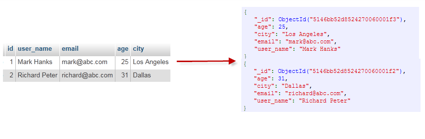

# ACID

# 1 基本概念

## 1.1  谈谈ACID规则

事务在英文中是transaction，和现实世界中的交易很类似，它有如下四个特性：

**1、A (Atomicity) 原子性**

原子性很容易理解，也就是说事务里的所有操作要么全部做完，要么都不做，事务成功的条件是事务里的所有操作都成功，只要有一个操作失败，整个事务就失败，需要回滚。

比如银行转账，从A账户转100元至B账户，分为两个步骤：1）从A账户取100元；2）存入100元至B账户。这两步要么一起完成，要么一起不完成，如果只完成第一步，第二步失败，钱会莫名其妙少了100元。

**2、C (Consistency) 一致性**

一致性也比较容易理解，也就是说数据库要一直处于一致的状态，事务的运行不会改变数据库原本的一致性约束。

例如现有完整性约束a+b=10，如果一个事务改变了a，那么必须得改变b，使得事务结束后依然满足a+b=10，否则事务失败。

> 保证事务只能把数据库从一个有效（正确）的状态“转移”到另一个有效（正确）的状态。那么，什么是数据库的有效(正确）的状态？满足给这个数据库pred-defined的一些规则的状态都是 valid 的。
>
> Eg. A要向B支付100元,而A的账户中只有90元,并且我们给定账户余额这一列的约束是,不能小于0.那么很明显这条事务执行会失败,因为90-100=-10,小于我们给定的约束了, 事务失败

**3、I (Isolation) 独立性**

所谓的独立性是指并发的事务之间不会互相影响，如果一个事务要访问的数据正在被另外一个事务修改，只要另外一个事务未提交，它所访问的数据就不受未提交事务的影响。

比如现在有个交易是从A账户转100元至B账户，在这个交易还未完成的情况下，如果此时B查询自己的账户，是看不到新增加的100元的。

**4、D (Durability) 持久性**

持久性是指一旦事务提交后，它所做的修改将会永久的保存在数据库上，即使出现宕机也不会丢失。


## 1.2  谈谈CAP定理

在计算机科学中, CAP定理（CAP theorem）, 又被称作 布鲁尔定理（Brewer's theorem）, 它指出对于一个分布式计算系统来说，不可能同时满足以下三点:

- **一致性(Consistency)** (所有节点在同一时间具有相同的数据)
- **可用性(Availability)** (保证每个请求不管成功或者失败都有响应)
- **分隔容忍(Partition tolerance)** (系统中任意信息的丢失或失败不会影响系统的继续运作)

CAP理论的核心是：一个分布式系统不可能同时很好的满足一致性，可用性和分区容错性这三个需求，最多只能同时较好的满足两个。

因此，根据 CAP 原理将 NoSQL 数据库分成了满足 CA 原则、满足 CP 原则和满足 AP 原则三 大类：

- CA - 单点集群，满足一致性，可用性的系统，通常在可扩展性上不太强大。
- CP - 满足一致性，分区容忍性的系统，通常性能不是特别高。
- AP - 满足可用性，分区容忍性的系统，通常可能对一致性要求低一些。


## 1.3 谈谈NoSQL数据库的BASE定理

BASE：Basically Available, Soft-state, Eventually Consistent。 由 Eric Brewer 定义。

CAP理论的核心是：一个分布式系统不可能同时很好的满足一致性，可用性和分区容错性这三个需求，最多只能同时较好的满足两个。

BASE是NoSQL数据库通常对可用性及一致性的弱要求原则:

- Basically Availble --基本可用
- Soft-state --软状态/柔性事务。 "Soft state" 可以理解为"无连接"的, 而 "Hard state" 是"面向连接"的
- Eventual Consistency -- 最终一致性， 也是 ACID 的最终目的。

## 1.4 谈谈NoSQL 优缺点

优点:

- \- 高可扩展性
- \- 分布式计算
- \- 低成本
- \- 架构的灵活性，半结构化数据
- \- 没有复杂的关系

缺点:

- \- 没有标准化
- \- 有限的查询功能（到目前为止）
- \- 最终一致是不直观的程序

# 2 MongoDB

MongoDB 将数据存储为一个文档，数据结构由键值(key=>value)对组成。MongoDB 文档类似于 JSON 对象。字段值可以包含其他文档，数组及文档数组。

## 2.1 概念解析

| SQL术语/概念 | MongoDB术语/概念 | 解释/说明                           |
| :----------- | :--------------- | :---------------------------------- |
| database     | database         | 数据库                              |
| table        | collection       | 数据库表/集合                       |
| row          | document         | 数据记录行/文档                     |
| column       | field            | 数据字段/域                         |
| index        | index            | 索引                                |
| table joins  |                  | 表连接,MongoDB不支持                |
| primary key  | primary key      | 主键,MongoDB自动将_id字段设置为主键 |



### 2.1.1 文档

文档是一组键值(key-value)对(即 BSON)。MongoDB 的文档不需要设置相同的字段，并且**相同的字段(Field)不需要相同的数据类型**，这与关系型数据库有很大的区别，也是 MongoDB 非常突出的特点。

一个简单的文档例子如下：

```json
{"site":"www.runoob.com", "name":"菜鸟教程"}
```

### 2.1.2 集合

集合就是 MongoDB 文档组，类似于 RDBMS （关系数据库管理系统：Relational Database Management System)中的表格。

集合存在于数据库中，集合没有固定的结构，这意味着你在对集合可以插入不同格式和类型的数据，但通常情况下我们插入集合的数据都会有一定的关联性。

比如，我们可以将以下不同数据结构的文档插入到集合中：

```json
{"site":"www.baidu.com"}
{"site":"www.google.com","name":"Google"}
{"site":"www.runoob.com","name":"菜鸟教程","num":5}
```

## 2.2 MongoDB数据类型

| 数据类型           | 描述                                                         |
| :----------------- | :----------------------------------------------------------- |
| String             | 字符串。存储数据常用的数据类型。在 MongoDB 中，UTF-8 编码的字符串才是合法的。 |
| Integer            | 整型数值。用于存储数值。根据你所采用的服务器，可分为 32 位或 64 位。 |
| Boolean            | 布尔值。用于存储布尔值（真/假）。                            |
| Double             | 双精度浮点值。用于存储浮点值。                               |
| Min/Max keys       | 将一个值与 BSON（二进制的 JSON）元素的最低值和最高值相对比。 |
| Array              | 用于将数组或列表或多个值存储为一个键。                       |
| Timestamp          | 时间戳。记录文档修改或添加的具体时间。                       |
| Object             | 用于内嵌文档。                                               |
| Null               | 用于创建空值。                                               |
| Symbol             | 符号。该数据类型基本上等同于字符串类型，但不同的是，它一般用于采用特殊符号类型的语言。 |
| Date               | 日期时间。用 UNIX 时间格式来存储当前日期或时间。你可以指定自己的日期时间：创建 Date 对象，传入年月日信息。 |
| Object ID          | 对象 ID。用于创建文档的 ID。                                 |
| Binary Data        | 二进制数据。用于存储二进制数据。                             |
| Code               | 代码类型。用于在文档中存储 JavaScript 代码。                 |
| Regular expression | 正则表达式类型。用于存储正则表达式。                         |

### 2.2.1 ObjectId

MongoDB 中存储的文档必须有一个 _id 键。这个键的值可以是任何类型的，默认是个 ObjectId 对象。类似唯一主键，可以很快的去生成和排序，包含 12 bytes，含义是：

- 前 4 个字节表示创建 **unix** 时间戳,格林尼治时间 **UTC** 时间，比北京时间晚了 8 个小时
- 接下来的 3 个字节是机器标识码
- 紧接的两个字节由进程 id 组成 PID
- 最后三个字节是随机数


### 2.2.2 时间戳

BSON 有一个特殊的时间戳类型用于 MongoDB 内部使用，与普通的 日期 类型不相关。 时间戳值是一个 64 位的值。其中：

- 前32位是一个 time_t 值（与Unix新纪元相差的秒数）
- 后32位是在某秒中操作的一个递增的`序数`

在单个 mongod 实例中，时间戳值通常是唯一的。

在复制集中， oplog 有一个 ts 字段。这个字段中的值使用BSON时间戳表示了操作时间。

> BSON 时间戳类型主要用于 MongoDB 内部使用。在大多数情况下的应用开发中，你可以使用 BSON 日期类型。

### 2.2.3 日期

表示当前距离 Unix新纪元（1970年1月1日）的毫秒数。日期类型是有符号的, 负数表示 1970 年之前的日期。

```
> var mydate1 = new Date()     //格林尼治时间
> mydate1
ISODate("2018-03-04T14:58:51.233Z")
> typeof mydate1
object
> var mydate2 = ISODate() //格林尼治时间
> mydate2
ISODate("2018-03-04T15:00:45.479Z")
> typeof mydate2
object
```

这样创建的时间是日期类型，可以使用 JS 中的 Date 类型的方法。

返回一个时间类型的字符串：

```
> var mydate1str = mydate1.toString()
> mydate1str
Sun Mar 04 2018 14:58:51 GMT+0000 (UTC) 
> typeof mydate1str
string
```

或者

```
> Date()
Sun Mar 04 2018 15:02:59 GMT+0000 (UTC)   
```

# 3 MongoDB CRUD

## 3.1 增

以下文档可以存储在 MongoDB 的 runoob 数据库 的 col 集合中：

```
>db.col.insert({
    title: 'MongoDB 教程', 
    description: 'MongoDB 是一个 Nosql 数据库',
    by: '菜鸟教程',
    url: 'http://www.runoob.com',
    tags: ['mongodb', 'database', 'NoSQL'],
    likes: 100
})
```


## 3.2 删

我们移除 title 为 'MongoDB 教程' 的文档：

```
>db.col.remove({'title':'MongoDB 教程'})
```


## 3.3 改

接着我们通过 update() 方法来更新标题(title):

```
>db.col.update({'title':'MongoDB 教程'},{$set:{'title':'MongoDB'}})
```


## 3.4 查

MongoDB 查询数据的语法格式如下：

```
db.collection.find(query, projection)
```

- **query** ：可选，使用查询操作符指定查询条件
- **projection** ：可选，使用投影操作符指定返回的键。查询时返回文档中所有键值， 只需省略该参数即可（默认省略）。

如果你需要以易读的方式来读取数据，可以使用 pretty() 方法，pretty() 方法以格式化的方式来显示所有文档，语法格式如下：

```
>db.col.find().pretty()
```

Eg .

```
> db.col.find({"by":"菜鸟教程", "title":"MongoDB 教程"}).pretty()
```

### 条件查询：MongoDB 与 RDBMS Where 语句比较

如果你熟悉常规的 SQL 数据，通过下表可以更好的理解 MongoDB 的条件语句查询：

| 操作       | 格式                     | 范例                                        | RDBMS中的类似语句       |
| :--------- | :----------------------- | :------------------------------------------ | :---------------------- |
| 等于       | `{<key>:<value>`}        | `db.col.find({"by":"菜鸟教程"}).pretty()`   | `where by = '菜鸟教程'` |
| 小于       | `{<key>:{$lt:<value>}}`  | `db.col.find({"likes":{$lt:50}}).pretty()`  | `where likes < 50`      |
| 小于或等于 | `{<key>:{$lte:<value>}}` | `db.col.find({"likes":{$lte:50}}).pretty()` | `where likes <= 50`     |
| 大于       | `{<key>:{$gt:<value>}}`  | `db.col.find({"likes":{$gt:50}}).pretty()`  | `where likes > 50`      |
| 大于或等于 | `{<key>:{$gte:<value>}}` | `db.col.find({"likes":{$gte:50}}).pretty()` | `where likes >= 50`     |
| 不等于     | `{<key>:{$ne:<value>}}`  | `db.col.find({"likes":{$ne:50}}).pretty()`  | `where likes != 50`     |

## 3.5 使用Node.js 连接MongoDB

https://www.runoob.com/nodejs/nodejs-mongodb.html