# 1 Node.js 创建第一个应用

如果我们使用 PHP 来编写后端的代码时，需要 Apache 或者 Nginx 的 HTTP 服务器，并配上 mod_php5 模块和 php-cgi。

从这个角度看，整个"接收 HTTP 请求并提供 Web 页面"的需求就不需要 PHP 来处理。

不过对 Node.js 来说，概念完全不一样了。使用 Node.js 时，我们不仅仅 在实现一个应用，同时还实现了整个 HTTP 服务器。事实上，我们的 Web 应用以及对应的 Web 服务器基本上是一样的。

在我们创建 Node.js 第一个 "Hello, World!" 应用前，让我们先了解下 Node.js 应用是由哪几部分组成的：

1. **引入 required 模块：**我们可以使用 **require** 指令来载入 Node.js 模块。

   ```javascript
   var http = require("http");
   ```

2. **创建服务器：**服务器可以监听客户端的请求，类似于 Apache 、Nginx 等 HTTP 服务器。

   接下来我们使用 http.createServer() 方法创建服务器，并使用 listen 方法绑定 8888 端口。 函数通过 request, response 参数来接收和响应数据。

   实例如下，在你项目的根目录下创建一个叫 server.js 的文件，并写入以下代码：

   ```javascript
   var http = require('http');
   
   http.createServer(function (request, response) {
   
       // 发送 HTTP 头部 
       // HTTP 状态值: 200 : OK
       // 内容类型: text/plain
       response.writeHead(200, {'Content-Type': 'text/plain'});
   
       // 发送响应数据 "Hello World"
       response.end('Hello World\n');
   }).listen(8888);
   
   // 终端打印如下信息
   console.log('Server running at http://127.0.0.1:8888/');
   ```

   以上代码我们完成了一个可以工作的 HTTP 服务器。

   使用 **node** 命令执行以上的代码：

   ```
   node server.js
   Server running at http://127.0.0.1:8888/
   ```

3. **接收请求与响应请求** 服务器很容易创建，客户端可以使用浏览器或终端发送 HTTP 请求，服务器接收请求后返回响应数据。

---

# 2 npm

## 2.1 npm 安装 Node.js 模块

```
$ npm install <Module Name>
```

以下实例，我们使用 npm 命令安装常用的 Node.js web框架模块 **express**:

```
$ npm install express
```

安装好之后，express 包就放在了工程目录下的 node_modules 目录中，因此在代码中只需要通过 **require('express')** 的方式就好，无需指定第三方包路径。

```
var express = require('express');
```


# 3 node.js 操作

## 3.1 基本

读文件

```javascript
const fs = require('fs');
fs.writeFile('./log.txt', 'hello', (err, data) => {
    if (err) {
        console.log("出错了");
    } else {
        console.log('文件创建成了');
      	console.log(data.toString());
    }
} );
```

然后终端运行

```shell
node file.js
```


进程，主函数传参

```javascript
function main(argv) {
    console.log(argv);
}

// 取出从2号参数开始的参数们
// 0号和1号参数为node地址和脚本地址
// node process.js argv1 argv2
main(process.argv.slice(2));
```

网络通信

``` javascript
const http = require('http');

const server = http.createServer((req, resp) => {
    let url = req.url;
    resp.write(url);
    resp.end();
});

server.listen(8090,()=> {
    console.log('localhost:8090');
});
```


## 3.2 Node相关工具

### 3.2.1 npm

Node包管理工具

```shell
# npm 目录下初始化
npm init -y # 一切都yes

# 全剧目录安包(任何目录下可以require(''), 带命令行的也能用shell直接调用)
npm install gulp -g

# 全剧卸载
npm uninstall gulp -g

# 在本地目录装package
npm i gulp --dev-save # install 可以简写， --dev是指开发环境的包，-save配置存在package.json里

# 在包的.bin文件夹下找对应命令
./node_modules/.bin/gulp -v

# 麻烦！
# 方法1:
# 进入package.json，在scripts那一项里加
#  "dev": "./node_modules/.bin/gulp -v"
# 或者直接写：
# "dev": "gulp -v"
# 然后在终端那个文件夹下执行：
npm run dev
```

**其他的你自学吧...**


### 3.2.2 npm脚本

就是package.json那个script字段里的内容

没啥，就是前面键值是npm 啥，值是执行啥shell指令

**其他的你自学吧...**


# 4 Node.js回调函数

Node.js 异步编程的直接体现就是回调。

异步编程依托于回调来实现，但不能说使用了回调后程序就异步化了。

回调函数在完成任务后就会被调用，Node 使用了大量的回调函数，Node 所有 API 都支持回调函数。

> 例如，我们可以一边读取文件，一边执行其他命令，在文件读取完成后，我们将文件内容作为回调函数的参数返回。这样在执行代码时就没有阻塞或等待文件 I/O 操作。这就大大提高了 Node.js 的性能，可以处理大量的并发请求。

```javascript
function foo1(name, age, callback) { }
function foo2(value, callback1, callback2) { }
```

## 4.1 阻塞与非阻塞

**阻塞代码实例**

创建一个文件 input.txt ，内容如下：

```
菜鸟教程官网地址：www.runoob.com
```

创建 main.js 文件, 代码如下：

```javascript
var fs = require("fs");

var data = fs.readFileSync('input.txt');

console.log(data.toString());
console.log("程序执行结束!");
```

以上代码执行结果如下：

```
$ node main.js
菜鸟教程官网地址：www.runoob.com

程序执行结束!
```

**非阻塞代码实例**

创建 main.js 文件, 代码如下：

```javascript
var fs = require("fs");

fs.readFile('input.txt', function (err, data) {
    if (err) return console.error(err);
    console.log(data.toString());
});

console.log("程序执行结束!");
```

以上代码执行结果如下：

```
$ node main.js
程序执行结束!
菜鸟教程官网地址：www.runoob.com
```

以上两个实例我们了解了阻塞与非阻塞调用的不同。第一个实例在文件读取完后才执行程序。 第二个实例我们不需要等待文件读取完，这样就可以在读取文件时同时执行接下来的代码，大大提高了程序的性能。

因此，阻塞是按顺序执行的，而非阻塞是不需要按顺序的，所以如果需要处理回调函数的参数，我们就需要写在回调函数内。

---

# 5 Node.js 事件循环

Node.js 是单进程单线程应用程序，但是因为 V8 引擎提供的异步执行回调接口，通过这些接口可以处理大量的并发，所以性能非常高。

Node.js 几乎每一个 API 都是支持回调函数的。

Node.js 基本上所有的事件机制都是用设计模式中观察者模式实现。

Node.js 单线程类似进入一个while(true)的事件循环，直到没有事件观察者退出，每个异步事件都生成一个事件观察者，如果有事件发生就调用该回调函数.

## 5.1 事件驱动程序


Node.js 使用事件驱动模型，当web server接收到请求，就把它关闭然后进行处理，然后去服务下一个web请求。

当这个请求完成，它被放回处理队列，当到达队列开头，这个结果被返回给用户。

这个模型非常高效可扩展性非常强，因为 webserver 一直接受请求而不等待任何读写操作。（这也称之为非阻塞式IO或者事件驱动IO）

在事件驱动模型中，会生成一个主循环来监听事件，当检测到事件时触发回调函数。

Node.js 有多个内置的事件，我们可以通过引入 events 模块，并通过实例化 EventEmitter 类来绑定和监听事件，如下实例：

```javascript
// 引入 events 模块
var events = require('events');
// 创建 eventEmitter 对象
var eventEmitter = new events.EventEmitter();
```

以下程序绑定事件处理程序：

```javascript
// 绑定事件及事件的处理程序
eventEmitter.on('eventName', eventHandler);
```

我们可以通过程序触发事件：

```javascript
// 触发事件
eventEmitter.emit('eventName');
```

**实例**

```javascript
// 引入events
var events = require('events');
// 创建eventEmitter对象
var eventEmitter = new events.EventEmitter();

// 创建事件处理程序
var connectHandler = function connected() {
    console.log('连接成功. ');

    // 触发data_received事件
    eventEmitter.emit('data_received');
}

// 绑定connection事件处理函数
eventEmitter.on('connection', connectHandler);

// 使用匿名函数绑定datareceived事件处理函数
eventEmitter.on('data_received', function() {
    console.log('数据接收成功. ');
});

// 触发connecion事件
eventEmitter.emit('connection');

console.log('执行玩了');

```

*输出*

```shell
$ node main.js
连接成功。
数据接收成功。
程序执行完毕。
```

---

# 6 EventEmitter

events 模块只提供了一个对象： events.EventEmitter。EventEmitter 的核心就是事件触发与事件监听器功能的封装。

你可以通过require("events");来访问该模块。

```javascript
// 引入 events 模块
var events = require('events');
// 创建 eventEmitter 对象
var eventEmitter = new events.EventEmitter();
```

EventEmitter 对象如果在实例化时发生错误，会触发 error 事件。当添加新的监听器时，newListener 事件会触发，当监听器被移除时，removeListener 事件被触发。

下面我们用一个简单的例子说明 EventEmitter 的用法：

```javascript
//event.js 文件
var EventEmitter = require('events').EventEmitter; 
var event = new EventEmitter(); 
event.on('some_event', function() { 
    console.log('some_event 事件触发'); 
}); 
setTimeout(function() { 
    event.emit('some_event'); 
}, 1000); 
```

执行结果如下：

运行这段代码，1 秒后控制台输出了 **'some_event 事件触发'**。其原理是 event 对象注册了事件 some_event 的一个监听器，然后我们通过 setTimeout 在 1000 毫秒以后向 event 对象发送事件 some_event，此时会调用some_event 的监听器。

```shell
$ node event.js 
some_event 事件触发
```

## 6.1 继承 EventEmitter

大多数时候我们不会直接使用 EventEmitter，而是在对象中继承它。包括 fs、net、 http 在内的，只要是支持事件响应的核心模块都是 EventEmitter 的子类。

为什么要这样做呢？原因有两点：

首先，具有某个实体功能的对象实现事件符合语义， 事件的监听和发生应该是一个对象的方法。

其次 JavaScript 的对象机制是基于原型的，支持 部分多重继承，继承 EventEmitter 不会打乱对象原有的继承关系。

---

# 7 Node.js Buffer

JavaScript 语言自身只有字符串数据类型，没有二进制数据类型。

但在处理像TCP流或文件流时，必须使用到二进制数据。因此在 Node.js中，定义了一个 Buffer 类，该类用来创建一个专门存放二进制数据的缓存区。


## 7.1 Buffer 与字符编码

Buffer 实例一般用于表示编码字符的序列，比如 UTF-8 、 UCS2 、 Base64 、或十六进制编码的数据。 通过使用显式的字符编码，就可以在 Buffer 实例与普通的 JavaScript 字符串之间进行相互转换。

```javascript
const buf = Buffer.from('runoob', 'ascii');

// 输出 72756e6f6f62
console.log(buf.toString('hex'));

// 输出 cnVub29i
console.log(buf.toString('base64'));
```

**Node.js 目前支持的字符编码包括：**

- **ascii** - 仅支持 7 位 ASCII 数据。如果设置去掉高位的话，这种编码是非常快的。
- **utf8** - 多字节编码的 Unicode 字符。许多网页和其他文档格式都使用 UTF-8 。
- **utf16le** - 2 或 4 个字节，小字节序编码的 Unicode 字符。支持代理对（U+10000 至 U+10FFFF）。
- **ucs2** - **utf16le** 的别名。
- **base64** - Base64 编码。
- **latin1** - 一种把 **Buffer** 编码成一字节编码的字符串的方式。
- **binary** - **latin1** 的别名。
- **hex** - 将每个字节编码为两个十六进制字符。


## 7.2 创建 Buffer 类

Buffer 提供了以下  API 来创建 Buffer 类：

- **Buffer.alloc(size[, fill[, encoding]])：** 返回一个指定大小的 Buffer 实例，如果没有设置 fill，则默认填满 0
- **Buffer.allocUnsafe(size)：** 返回一个指定大小的 Buffer 实例，但是它不会被初始化，所以它可能包含敏感的数据
- **Buffer.allocUnsafeSlow(size)**
- **Buffer.from(array)：** 返回一个被 array 的值初始化的新的 Buffer 实例（传入的 array 的元素只能是数字，不然就会自动被 0 覆盖）
- **Buffer.from(arrayBuffer[, byteOffset[, length]])：** 返回一个新建的与给定的 ArrayBuffer 共享同一内存的 Buffer。
- **Buffer.from(buffer)：** 复制传入的 Buffer 实例的数据，并返回一个新的 Buffer 实例
- **Buffer.from(string[, encoding])：** 返回一个被 string 的值初始化的新的 Buffer 实例


## 7.3 写入缓冲区

### 语法

写入 Node 缓冲区的语法如下所示：

```
buf.write(string[, offset[, length]][, encoding])
```

### 参数

参数描述如下：

- **string** - 写入缓冲区的字符串。
- **offset** - 缓冲区开始写入的索引值，默认为 0 。
- **length** - 写入的字节数，默认为 buffer.length
- **encoding** - 使用的编码。默认为 'utf8' 。

根据 encoding 的字符编码写入 string 到 buf 中的 offset 位置。 length 参数是写入的字节数。 如果 buf 没有足够的空间保存整个字符串，则只会写入 string 的一部分。 只部分解码的字符不会被写入。

### 返回值

返回实际写入的大小。如果 buffer 空间不足， 则只会写入部分字符串。

```javascript
let buf = Buffer.alloc(256);
len = buf.write("www.baidu.com");
console.log("写入字节数" + len);
```


## 7.4 从缓冲区读取数据

### 语法

读取 Node 缓冲区数据的语法如下所示：

```
buf.toString([encoding[, start[, end]]])
```

### 参数

参数描述如下：

- **encoding** - 使用的编码。默认为 'utf8' 。
- **start** - 指定开始读取的索引位置，默认为 0。
- **end** - 结束位置，默认为缓冲区的末尾。

### 返回值

解码缓冲区数据并使用指定的编码返回字符串。

### 实例

```javascript
buf = Buffer.alloc(26);
for (var i = 0 ; i < 26 ; i++) {
  buf[i] = i + 97;
}

console.log( buf.toString('ascii'));       // 输出: abcdefghijklmnopqrstuvwxyz
console.log( buf.toString('ascii',0,5));   //使用 'ascii' 编码, 并输出: abcde
console.log( buf.toString('utf8',0,5));    // 使用 'utf8' 编码, 并输出: abcde
console.log( buf.toString(undefined,0,5)); // 使用默认的 'utf8' 编码, 并输出: abcde
```

执行以上代码，输出结果为：

```shell
$ node main.js
abcdefghijklmnopqrstuvwxyz
abcde
abcde
abcde
```


## 7.5 将 Buffer 转换为 JSON 对象

### 语法

将 Node Buffer 转换为 JSON 对象的函数语法格式如下：

```
buf.toJSON()
```

当字符串化一个 Buffer 实例时，[JSON.stringify()](https://www.runoob.com/js/javascript-json-stringify.html) 会隐式地调用该 toJSON()。

### 返回值

返回 JSON 对象。

### 实例

```javascript
const buf = Buffer.from([0x1, 0x2, 0x3, 0x4, 0x5]);
const json = JSON.stringify(buf);

// 输出: {"type":"Buffer","data":[1,2,3,4,5]}
console.log(json);

const copy = JSON.parse(json, (key, value) => {
  return value && value.type === 'Buffer' ?
    Buffer.from(value.data) :
    value;
});

// 输出: <Buffer 01 02 03 04 05>
console.log(copy);
```

执行以上代码，输出结果为：

```
{"type":"Buffer","data":[1,2,3,4,5]}
<Buffer 01 02 03 04 05>
```


## 7.6 缓冲区合并

### 语法

Node 缓冲区合并的语法如下所示：

```
Buffer.concat(list[, totalLength])
```

### 参数

参数描述如下：

- **list** - 用于合并的 Buffer 对象数组列表。 
- **totalLength** - 指定合并后Buffer对象的总长度。

### 返回值

返回一个多个成员合并的新 Buffer 对象。

### 实例

```javascript
var buffer1 = Buffer.from(('菜鸟教程'));
var buffer2 = Buffer.from(('www.runoob.com'));
var buffer3 = Buffer.concat([buffer1,buffer2]);
console.log("buffer3 内容: " + buffer3.toString());
```

执行以上代码，输出结果为：

```
buffer3 内容: 菜鸟教程www.runoob.com
```


## 7.7 缓冲区比较

### 语法

Node Buffer 比较的函数语法如下所示, 该方法在 Node.js  v0.12.2 版本引入：

```
buf.compare(otherBuffer);
```

### 参数

参数描述如下：

- **otherBuffer** - 与 **buf** 对象比较的另外一个 Buffer 对象。 

### 返回值

返回一个数字，表示 **buf** 在 **otherBuffer** 之前，之后或相同。

### 实例

```javascript
var buffer1 = Buffer.from('ABC');
var buffer2 = Buffer.from('ABCD');
var result = buffer1.compare(buffer2);

if(result < 0) {
   console.log(buffer1 + " 在 " + buffer2 + "之前");
}else if(result == 0){
   console.log(buffer1 + " 与 " + buffer2 + "相同");
}else {
   console.log(buffer1 + " 在 " + buffer2 + "之后");
}
```

执行以上代码，输出结果为：

```
ABC在ABCD之前
```


## 7.8 拷贝缓冲区

### 语法

Node 缓冲区拷贝语法如下所示：

```
buf.copy(targetBuffer[, targetStart[, sourceStart[, sourceEnd]]])
```

### 参数

参数描述如下：

- **targetBuffer** -  要拷贝的 Buffer 对象。
- **targetStart** -  数字, 可选, 默认: 0
- **sourceStart** -  数字, 可选, 默认: 0
- **sourceEnd** -  数字, 可选, 默认: buffer.length

### 返回值

没有返回值。

### 实例

```javascript
var buf1 = Buffer.from('abcdefghijkl');
var buf2 = Buffer.from('RUNOOB');

//将 buf2 插入到 buf1 指定位置上
buf2.copy(buf1, 2);

console.log(buf1.toString());
```

执行以上代码，输出结果为：

```
abRUNOOBijkl
```


## 7.9 缓冲区裁剪

Node 缓冲区裁剪语法如下所示：

```
buf.slice([start[, end]])
```

### 参数

参数描述如下：

- **start** -   数字, 可选, 默认: 0
- **end** -   数字, 可选, 默认: buffer.length

### 返回值

返回一个新的缓冲区，它和旧缓冲区指向同一块内存，但是从索引 start 到 end 的位置剪切。

### 实例

```javascript
var buffer1 = Buffer.from('runoob');
// 剪切缓冲区
var buffer2 = buffer1.slice(0,2);
console.log("buffer2 content: " + buffer2.toString());
```

执行以上代码，输出结果为：

```
buffer2 content: ru
```


## 7.10 缓冲区长度

### 语法

Node 缓冲区长度计算语法如下所示：

```
buf.length;
```

### 返回值

返回 Buffer 对象所占据的内存长度。

### 实例

```javascript
var buffer = Buffer.from('www.runoob.com');
//  缓冲区长度
console.log("buffer length: " + buffer.length);
```

执行以上代码，输出结果为：

```
buffer length: 14
```

---

# 8 Node.js Stream流

Stream 是一个抽象接口，Node 中有很多对象实现了这个接口。例如，对http 服务器发起请求的request 对象就是一个 Stream，还有stdout（标准输出）。

## 8.1 流读入

Node.js，Stream 有四种流类型：

- **Readable** - 可读操作。
- **Writable** - 可写操作。
- **Duplex** - 可读可写操作.
- **Transform** - 操作被写入数据，然后读出结果。

所有的 Stream 对象都是 EventEmitter 的实例。常用的事件有：

- **data** - 当有数据可读时触发。
- **end** - 没有更多的数据可读时触发。
- **error** - 在接收和写入过程中发生错误时触发。
- **finish** - 所有数据已被写入到底层系统时触发。

**例子** 在本地创建input.txt文件，然后

```javascript
let fs = require('fs');
let data = '';

// 创建可读流
let readerStream = fs.createReadStream('input.txt');

// 设置编码为utf8
readerStream.setEncoding('UTF8');

// 处理流事件 data, end 和 error
readerStream.on('data', function (chunk) {
    data += chunk;
});

readerStream.on('end', function () {
    console.log(data);
});

readerStream.on('error', function (err) {
    console.log(err.stack);
});

console.log('执行玩了');
```

## 8.2 流输出

创建 main.js 文件, 代码如下：

```javascript
var fs = require("fs");
var data = '菜鸟教程官网地址：www.runoob.com';

// 创建一个可以写入的流，写入到文件 output.txt 中
var writerStream = fs.createWriteStream('output.txt');

// 使用 utf8 编码写入数据
writerStream.write(data,'UTF8');

// 标记文件末尾
writerStream.end();

// 处理流事件 --> finish、error
writerStream.on('finish', function() {
    console.log("写入完成。");
});

writerStream.on('error', function(err){
   console.log(err.stack);
});

console.log("程序执行完毕");
```

以上程序会将 data 变量的数据写入到 output.txt 文件中。代码执行结果如下：

```
$ node main.js 
程序执行完毕
写入完成。
```

## 8.3 管道流

管道提供了一个输出流到输入流的机制。通常我们用于从一个流中获取数据并将数据传递到另外一个流中。


以下实例我们通过读取一个文件内容并将内容写入到另外一个文件中。

设置 input.txt 文件内容如下：

```
菜鸟教程官网地址：www.runoob.com
管道流操作实例
```

创建 main.js 文件, 代码如下：

```javascript
var fs = require("fs");

// 创建一个可读流
var readerStream = fs.createReadStream('input.txt');

// 创建一个可写流
var writerStream = fs.createWriteStream('output.txt');

// 管道读写操作
// 读取 input.txt 文件内容，并将内容写入到 output.txt 文件中
readerStream.pipe(writerStream);

console.log("程序执行完毕");
```


## 8.4 链式流

链式是通过连接输出流到另外一个流并创建多个流操作链的机制。链式流一般用于管道操作。

接下来我们就是用管道和链式来压缩和解压文件。

创建 compress.js 文件, 代码如下：

```
var fs = require("fs");
var zlib = require('zlib');

// 压缩 input.txt 文件为 input.txt.gz
fs.createReadStream('input.txt')
  .pipe(zlib.createGzip())
  .pipe(fs.createWriteStream('input.txt.gz'));
  
console.log("文件压缩完成。");
```

代码执行结果如下：

```
$ node compress.js 
文件压缩完成。
```

执行完以上操作后，我们可以看到当前目录下生成了 input.txt 的压缩文件 input.txt.gz。

接下来，让我们来解压该文件，创建 decompress.js 文件，代码如下：

```
var fs = require("fs");
var zlib = require('zlib');

// 解压 input.txt.gz 文件为 input.txt
fs.createReadStream('input.txt.gz')
  .pipe(zlib.createGunzip())
  .pipe(fs.createWriteStream('input.txt'));
  
console.log("文件解压完成。");
```

---

# 9 Node.js 模块系统

模块是Node.js 应用程序的基本组成部分，文件和模块是一一对应的。换言之，一个 Node.js 文件就是一个模块，这个文件可能是JavaScript 代码、JSON 或者编译过的C/C++ 扩展。

## 9.1 引入模块

在 Node.js 中，引入一个模块非常简单，如下我们创建一个 **main.js** 文件并引入 hello 模块，代码如下:

```javascript
var hello = require('./hello');
hello.world();
```

以上实例中，代码 require('./hello') 引入了当前目录下的 hello.js 文件（./ 为当前目录，node.js 默认后缀为 js）。

Node.js 提供了 `exports` 和 `require` 两个对象，其中` exports `是模块公开的接口，require 用于从外部获取一个模块的接口，即所获取模块的` exports `对象。

接下来我们就来创建 hello.js 文件，代码如下：

```javascript
exports.world = function() {
  console.log('Hello World');
}
```

在以上示例中，hello.js 通过 exports 对象把 world 作为模块的访问接口，在 main.js 中通过 require('./hello') 加载这个模块，然后就可以直接访 问 hello.js 中 exports 对象的成员函数了。

例如:

```javascript
//hello.js 
function Hello() { 
    var name; 
    this.setName = function(thyName) { 
        name = thyName; 
    }; 
    this.sayHello = function() { 
        console.log('Hello ' + name); 
    }; 
}; 
module.exports = Hello;
```

这样就可以直接获得这个对象了：

```javascript
//main.js 
var Hello = require('./hello'); 
hello = new Hello(); 
hello.setName('BYVoid'); 
hello.sayHello(); 
```


## 9.2 模块加载方式

Node.js 的 require 方法中的文件查找策略如下：

由于 Node.js 中存在 4 类模块（原生模块和3种文件模块），尽管 require 方法极其简单，但是内部的加载却是十分复杂的，其加载优先级也各自不同。如下图所示：


### 从文件模块缓存中加载

尽管原生模块与文件模块的优先级不同，但是都会优先从文件模块的缓存中加载已经存在的模块。

### 从原生模块加载

原生模块的优先级仅次于文件模块缓存的优先级。require  方法在解析文件名之后，优先检查模块是否在原生模块列表中。以http模块为例，尽管在目录下存在一个  http/http.js/http.node/http.json 文件，require("http")  都不会从这些文件中加载，而是从原生模块中加载。

原生模块也有一个缓存区，同样也是优先从缓存区加载。如果缓存区没有被加载过，则调用原生模块的加载方式进行加载和执行。

### 从文件加载

当文件模块缓存中不存在，而且不是原生模块的时候，Node.js 会解析 require 方法传入的参数，并从文件系统中加载实际的文件，加载过程中的包装和编译细节在前一节中已经介绍过，这里我们将详细描述查找文件模块的过程，其中，也有一些细节值得知晓。

require方法接受以下几种参数的传递：

- http、fs、path等，原生模块。
- ./mod或../mod，相对路径的文件模块。
- /pathtomodule/mod，绝对路径的文件模块。
- mod，非原生模块的文件模块。

---

# 10 Node.js 函数

在 JavaScript中，一个函数可以作为另一个函数的参数。我们可以先定义一个函数，然后传递，也可以在传递参数的地方直接定义函数。

Node.js 中函数的使用与 JavaScript 类似，举例来说，你可以这样做：

```javascript
function say(word) {
  console.log(word);
}

function execute(someFunction, value) {
  someFunction(value);
}

execute(say, "Hello");
```

以上代码中，我们把 say 函数作为 execute 函数的第一个变量进行了传递。这里传递的不是 say 的返回值，而是 say 本身！

这样一来， say 就变成了execute 中的本地变量 someFunction ，execute 可以通过调用 someFunction() （带括号的形式）来使用 say 函数。

当然，因为 say 有一个变量， execute 在调用 someFunction 时可以传递这样一个变量。

**匿名函数**

我们可以把一个函数作为变量传递。但是我们不一定要绕这个"先定义，再传递"的圈子，我们可以直接在另一个函数的括号中定义和传递这个函数：

```javascript
function execute(someFunction, value) {
  someFunction(value);
}

execute(function(word){ console.log(word) }, "Hello");
```

我们在 execute 接受第一个参数的地方直接定义了我们准备传递给 execute 的函数。

用这种方式，我们甚至不用给这个函数起名字，这也是为什么它被叫做匿名函数 。

## 函数传递是如何让HTTP服务器工作的

带着这些知识，我们再来看看我们简约而不简单的HTTP服务器：

```javascript
var http = require("http");

http.createServer(function(request, response) {
  response.writeHead(200, {"Content-Type": "text/plain"});
  response.write("Hello World");
  response.end();
}).listen(8888);
```

现在它看上去应该清晰了很多：我们向 createServer 函数传递了一个匿名函数。

用这样的代码也可以达到同样的目的：

```javascript
var http = require("http");

function onRequest(request, response) {
  response.writeHead(200, {"Content-Type": "text/plain"});
  response.write("Hello World");
  response.end();
}

http.createServer(onRequest).listen(8888);
```


# 11 Node.js 路由

我们要为路由提供请求的 URL 和其他需要的 GET 及 POST 参数，随后路由需要根据这些数据来执行相应的代码。

因此，我们需要查看 HTTP 请求，从中提取出请求的 URL 以及 GET/POST 参数。

我们需要的所有数据都会包含在 request 对象中，该对象作为 onRequest() 回调函数的第一个参数传递。但是为了解析这些数据，我们需要额外的 Node.JS 模块，它们分别是 url 和 querystring 模块。

当然我们也可以用 querystring 模块来解析 POST 请求体中的参数，稍后会有演示。

现在我们来给 onRequest() 函数加上一些逻辑，用来找出浏览器请求的 URL 路径：

**server.js 文件代码：**

```javascript
var http = require("http");
var url = require("url");
 
function start() {
  function onRequest(request, response) {
    var pathname = url.parse(request.url).pathname;
    console.log("Request for " + pathname + " received.");
    response.writeHead(200, {"Content-Type": "text/plain"});
    response.write("Hello World");
    response.end();
  }
 
  http.createServer(onRequest).listen(8888);
  console.log("Server has started.");
}
 
exports.start = start;
```


好了，我们的应用现在可以通过请求的 URL 路径来区别不同请求了--这使我们得以使用路由（还未完成）来将请求以 URL 路径为基准映射到处理程序上。

在我们所要构建的应用中，这意味着来自 /start 和 /upload 的请求可以使用不同的代码来处理。稍后我们将看到这些内容是如何整合到一起的。

现在我们可以来编写路由了，建立一个名为 **router.js** 的文件，添加以下内容：

**router.js 文件代码：**

```javascript
function route(pathname) {
  console.log("About to route a request for " + pathname);
}
 
exports.route = route;
```


如你所见，这段代码什么也没干，不过对于现在来说这是应该的。在添加更多的逻辑以前，我们先来看看如何把路由和服务器整合起来。

我们的服务器应当知道路由的存在并加以有效利用。我们当然可以通过硬编码的方式将这一依赖项绑定到服务器上，但是其它语言的编程经验告诉我们这会是一件非常痛苦的事，因此我们将使用依赖注入的方式较松散地添加路由模块。

首先，我们来扩展一下服务器的 start() 函数，以便将路由函数作为参数传递过去，**server.js** 文件代码如下

**server.js 文件代码：**

```javascript
var http = require("http");
var url = require("url");
 
function start(route) {
  function onRequest(request, response) {
    var pathname = url.parse(request.url).pathname;
    console.log("Request for " + pathname + " received.");
 
    route(pathname);
 
    response.writeHead(200, {"Content-Type": "text/plain"});
    response.write("Hello World");
    response.end();
  }
 
  http.createServer(onRequest).listen(8888);
  console.log("Server has started.");
}
 
exports.start = start;
```


同时，我们会相应扩展 index.js，使得路由函数可以被注入到服务器中：

**index.js 文件代码：**

```javascript
var server = require("./server");
var router = require("./router");
 
server.start(router.route);
```

如果现在启动应用（node index.js，始终记得这个命令行），随后请求一个URL，你将会看到应用输出相应的信息，这表明我们的HTTP服务器已经在使用路由模块了，并会将请求的路径传递给路由：

---

# 12 GET/POST

## 12.1 获取GET请求内容

由于GET请求直接被嵌入在路径中，URL是完整的请求路径，包括了?后面的部分，因此你可以手动解析后面的内容作为GET请求的参数。

node.js 中 url 模块中的 parse 函数提供了这个功能。

```javascript
var http = require('http');
var url = require('url');
var util = require('util');
 
http.createServer(function(req, res){
    res.writeHead(200, {'Content-Type': 'text/plain; charset=utf-8'});
    res.end(util.inspect(url.parse(req.url, true)));
}).listen(3000);
```

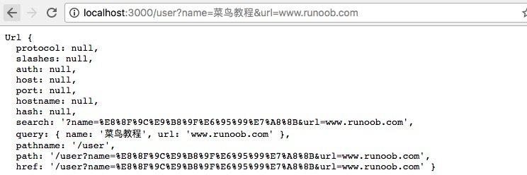

## 12.2 获取GET的URL参数

```javascript
const util = require('util');

http.createServer(function (req, res) {
    res.writeHead(200, {'Content-type': 'text/plain'});

    let param = url.parse(req.url, true).query;
    res.write('name: ' + param.name);
    res.write('\n');
    res.write('URL: ' + param.url);
    res.end();
}).listen(3000);
```

## 12.3 获取POST请求内容

POST 请求的内容全部的都在请求体中，http.ServerRequest 并没有一个属性内容为请求体，原因是等待请求体传输可能是一件耗时的工作。

比如上传文件，而很多时候我们可能并不需要理会请求体的内容，恶意的POST请求会大大消耗服务器的资源，所以 node.js 默认是不会解析请求体的，当你需要的时候，需要手动来做。

**基本语法**

```javascript
var http = require('http');
var querystring = require('querystring');
var util = require('util');
 
http.createServer(function(req, res){
    // 定义了一个post变量，用于暂存请求体的信息
    var post = '';     
 
    // 通过req的data事件监听函数，每当接受到请求体的数据，就累加到post变量中
    req.on('data', function(chunk){    
        post += chunk;
    });
 
    // 在end事件触发后，通过querystring.parse将post解析为真正的POST请求格式，然后向客户端返回。
    req.on('end', function(){    
        post = querystring.parse(post);
        res.end(util.inspect(post));
    });
}).listen(3000);
```

**使用POST提交并输出数据**

```javascript
var http = require('http');
var querystring = require('querystring');
 
var postHTML = 
  '<html><head><meta charset="utf-8"><title>菜鸟教程 Node.js 实例</title></head>' +
  '<body>' +
  '<form method="post">' +
  '网站名： <input name="name"><br>' +
  '网站 URL： <input name="url"><br>' +
  '<input type="submit">' +
  '</form>' +
  '</body></html>';
 
http.createServer(function (req, res) {
  var body = "";
  req.on('data', function (chunk) {
    body += chunk;
  });
  req.on('end', function () {
    // 解析参数
    body = querystring.parse(body);
    // 设置响应头部信息及编码
    res.writeHead(200, {'Content-Type': 'text/html; charset=utf8'});
 
    if(body.name && body.url) { // 输出提交的数据
        res.write("网站名：" + body.name);
        res.write("<br>");
        res.write("网站 URL：" + body.url);
    } else {  // 输出表单
        res.write(postHTML);
    }
    res.end();
  });
}).listen(3000);
```

# 13 Node.js WEB

## 13.1 搭建一个服务器

```javascript
var http = require('http');
var fs = require('fs');
var url = require('url');
 
 
// 创建服务器
http.createServer( function (request, response) {  
   // 解析请求，包括文件名
   var pathname = url.parse(request.url).pathname;
   
   // 输出请求的文件名
   console.log("Request for " + pathname + " received.");
   
   // 从文件系统中读取请求的文件内容
   fs.readFile(pathname.substr(1), function (err, data) {
      if (err) {
         console.log(err);
         // HTTP 状态码: 404 : NOT FOUND
         // Content Type: text/html
         response.writeHead(404, {'Content-Type': 'text/html'});
      }else{             
         // HTTP 状态码: 200 : OK
         // Content Type: text/html
         response.writeHead(200, {'Content-Type': 'text/html'});    
         
         // 响应文件内容
         response.write(data.toString());        
      }
      //  发送响应数据
      response.end();
   });   
}).listen(8080);
 
// 控制台会输出以下信息
console.log('Server running at http://127.0.0.1:8080/');
```

## 13.2 创建客户端

```javascript
var http = require('http');
 
// 用于请求的选项
var options = {
   host: 'localhost',
   port: '8080',
   path: '/index.html'  
};
 
// 处理响应的回调函数
var callback = function(response){
   // 不断更新数据
   var body = '';
   response.on('data', function(data) {
      body += data;
   });
   
   response.on('end', function() {
      // 数据接收完成
      console.log(body);
   });
}
// 向服务端发送请求
var req = http.request(options, callback);
req.end();
```

# 14 Express框架

## 14.1 helloworld

```javascript
var express = require('express');
var app = express();

app.get('/', function (req, res) {
    res.send('Hello World');
})

var server = app.listen(8081, function () {

    var host = server.address().address
    var port = server.address().port

    console.log("应用实例，访问端口%s", port)

});
```

## 14.2 请求和响应

**request** 和 **response** 对象的具体介绍：

```javascript
var express = require('express');
var app = express();
app.get('/', function (req, res) {
   // --
})
```


**Request 对象** - request 对象表示 HTTP 请求，包含了请求查询字符串，参数，内容，HTTP 头部等属性。常见属性有： 

1. req.app：当callback为外部文件时，用req.app访问express的实例
2. req.baseUrl：获取路由当前安装的URL路径
3. req.body / req.cookies：获得「请求主体」/ Cookies
4. req.fresh / req.stale：判断请求是否还「新鲜」
5. req.hostname / req.ip：获取主机名和IP地址
6. req.originalUrl：获取原始请求URL
7. req.params：获取路由的parameters
8. req.path：获取请求路径
9. req.protocol：获取协议类型
10. req.query：获取URL的查询参数串
11. req.route：获取当前匹配的路由
12. req.subdomains：获取子域名
13. req.accepts()：检查可接受的请求的文档类型
14. req.acceptsCharsets / req.acceptsEncodings / req.acceptsLanguages：返回指定字符集的第一个可接受字符编码
15. req.get()：获取指定的HTTP请求头
16. req.is()：判断请求头Content-Type的MIME类型

**Response 对象** - response 对象表示 HTTP 响应，即在接收到请求时向客户端发送的 HTTP 响应数据。常见属性有：

1. res.app：同req.app一样
2. res.append()：追加指定HTTP头
3. res.set()在res.append()后将重置之前设置的头
4. res.cookie(name，value [，option])：设置Cookie
5. opition: domain / expires / httpOnly / maxAge / path / secure / signed
6. res.clearCookie()：清除Cookie
7. res.download()：传送指定路径的文件
8. res.get()：返回指定的HTTP头
9. res.json()：传送JSON响应
10. res.jsonp()：传送JSONP响应
11. res.location()：只设置响应的Location HTTP头，不设置状态码或者close response
12. res.redirect()：设置响应的Location HTTP头，并且设置状态码302
13. res.render(view,[locals],callback)：渲染一个view，同时向callback传递渲染后的字符串，如果在渲染过程中有错误发生next(err)将会被自动调用。callback将会被传入一个可能发生的错误以及渲染后的页面，这样就不会自动输出了。
14. res.send()：传送HTTP响应
15. res.sendFile(path [，options] [，fn])：传送指定路径的文件 -会自动根据文件extension设定Content-Type
16. res.set()：设置HTTP头，传入object可以一次设置多个头
17. res.status()：设置HTTP状态码
18. res.type()：设置Content-Type的MIME类型


------

## 14.3 路由

```javascript
var express = require('express');
var app = express();
 
//  主页输出 "Hello World"
app.get('/', function (req, res) {
   console.log("主页 GET 请求");
   res.send('Hello GET');
})
 
 
//  POST 请求
app.post('/', function (req, res) {
   console.log("主页 POST 请求");
   res.send('Hello POST');
})
 
//  /del_user 页面响应
app.get('/del_user', function (req, res) {
   console.log("/del_user 响应 DELETE 请求");
   res.send('删除页面');
})
 
//  /list_user 页面 GET 请求
app.get('/list_user', function (req, res) {
   console.log("/list_user GET 请求");
   res.send('用户列表页面');
})
 
// 对页面 abcd, abxcd, ab123cd, 等响应 GET 请求
app.get('/ab*cd', function(req, res) {   
   console.log("/ab*cd GET 请求");
   res.send('正则匹配');
})

// 不带query路由
app.use('/aaa', function(req, res) {
  console.log(123);
  res.send('22233');
})
 
 
var server = app.listen(8081, function () {
 
  var host = server.address().address
  var port = server.address().port
 
  console.log("应用实例，访问地址为 http://%s:%s", host, port)
 
})
```

**引入路由模块**

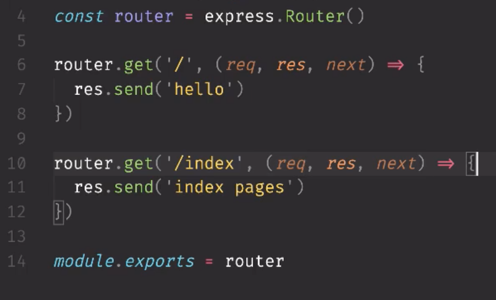

## 14.4 静态文件

Express 提供了内置的中间件 **express.static** 来设置静态文件如：图片， CSS, JavaScript 等。

你可以使用 **express.static** 中间件来设置静态文件路径。例如，如果你将图片， CSS, JavaScript 文件放在 public 目录下，你可以这么写：

```javascript
app.use('/public', express.static('public'));
```

我们可以到 public/images 目录下放些图片,如下所示：

```
node_modules
server.js
public/
public/images
public/images/logo.png
```

```javascript
var express = require('express');
var app = express();

app.use('/public', express.static('public'));

app.get('/', function (req, res) {
    res.send('Hello World');
})

var server = app.listen(8081, function () {

    var host = server.address().address
    var port = server.address().port

    console.log("应用实例，访问地址为 http://%s:%s", host, port)

});
```

访问http://127.0.0.1:8081/public/images/logo.png，能看到图

## 14.5 GET

今天，有个首页index.html:

```html
<html>
<body>
<form action="http://127.0.0.1:8081/process_get" method="GET">
First Name: <input type="text" name="first_name">  <br>
 
Last Name: <input type="text" name="last_name">
<input type="submit" value="Submit">
</form>
</body>
</html>
```

处理代码:

```javascript
var express = require('express');
var app = express();

app.use('/public', express.static('public'));

app.get('/index.html', function (req, res) {
    res.sendFile( __dirname + "/" + "index.html" );
})

app.get('/process_get', function (req, res) {

    // 输出 JSON 格式
    var response = {
        "first_name":req.query.first_name,
        "last_name":req.query.last_name
    };
    console.log(response);
    res.end(JSON.stringify(response));
});

let server = app.listen(8081, function () {
    console.log('8081, go go go.');
});
```


## 14.6 POST

==post 解析需要第三方中间件 body-parser, 用来解析node.js body的==

```html
<html>
<body>
<form action="http://127.0.0.1:8081/process_post" method="POST">
First Name: <input type="text" name="first_name">  <br>
 
Last Name: <input type="text" name="last_name">
<input type="submit" value="Submit">
</form>
</body>
</html>
```

```javascript
var express = require('express');
var app = express();
var bodyParser = require('body-parser');
 
// 创建 application/x-www-form-urlencoded 编码解析
var urlencodedParser = bodyParser.urlencoded({ extended: false });
 
app.use('/public', express.static('public'));
 
app.get('/index.html', function (req, res) {
   res.sendFile( __dirname + "/" + "index.html" );
});
 
app.post('/process_post', urlencodedParser, function (req, res) {
 
   // 输出 JSON 格式
   var response = {
       "first_name":req.body.first_name,
       "last_name":req.body.last_name
   };
   console.log(response);
   res.end(JSON.stringify(response));
});
 
var server = app.listen(8081, function () {
 
  var host = server.address().address
  var port = server.address().port
 
  console.log("应用实例，访问地址为 http://%s:%s", host, port)
 
});
```

**上面那个可以解析出来用表单post提交的信息，如果是post提交的直接是json串:**

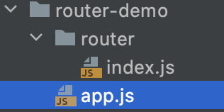

```javascript
// app.js

const express = require('express');
const app = express();

// 调用写好的router
const router = require('./router/index');

const bodyParser = require('body-parser');


// 用这个接收post进来的json信息
app.use(bodyParser.json());

app.use('/', router)

let server = app.listen(8081, (req, res) => {
    console.log("8081");
})


```


```javascript
// index.js

const express = require('express');
const router = express.Router();
const querystring = require('querystring');
const bodyParser = require('body-parser');

// 创建 application/x-www-form-urlencoded 编码解析
var urlencodedParser = bodyParser.urlencoded({ extended: false });

// 都是中间件
// 不过和use的中间件不一样，没有匹配优先顺序，匹配是谁就是谁
router.get('/', (req, res, next) =>
{
    res.send('hello, root');
});

router.get('/index', (req, res, next) => {

    // 获取query对象
    let query = req.query;
    console.log(query);
    // 返回的事JSON
    // res.send(query);
    // 返回字符串呢?
    res.send(querystring.stringify(query));

});

// post 解析需要第三方中间件 body-parser, 用来解析node.js body的
router.post('/index', urlencodedParser, (req, res, next) => {
    let data = req.body;
    console.log(data);
    //console.log(data);
    res.send(data);
});

module.exports = router;

```


## 14.7 增删改茶

虽然一个post能做所有事情，但是put, patch, delete能够增加后端可读性，前端只需要改method

如果不用的话，需要域名里加/add, /delete之类的。

```javascript
// 查(覆盖式)
router.get('/index', (req, res, next) => {
  
})

// 修改数据(覆盖式)
router.post('/index', (req, res, next) => {
  
})

// 修改数据(覆盖式)
router.put('/index', (req, res, next) => {
  
})

// 修改数据（增量修改）
router.patch('/index', (req, res, next) => {
  
})

//删除
router.delete('/index', (req, res, next) => {
  
})
```

## 14.7 Cookie

我们可以使用中间件向 Node.js 服务器发送 cookie 信息，以下代码输出了客户端发送的 cookie 信息：

```javascript
// express_cookie.js 文件
var express      = require('express')
var cookieParser = require('cookie-parser')
var util = require('util');
 
var app = express()
app.use(cookieParser())
 
app.get('/', function(req, res) {
    console.log("Cookies: " + util.inspect(req.cookies));
})
 
app.listen(8081)
```


## 14.8 中间件

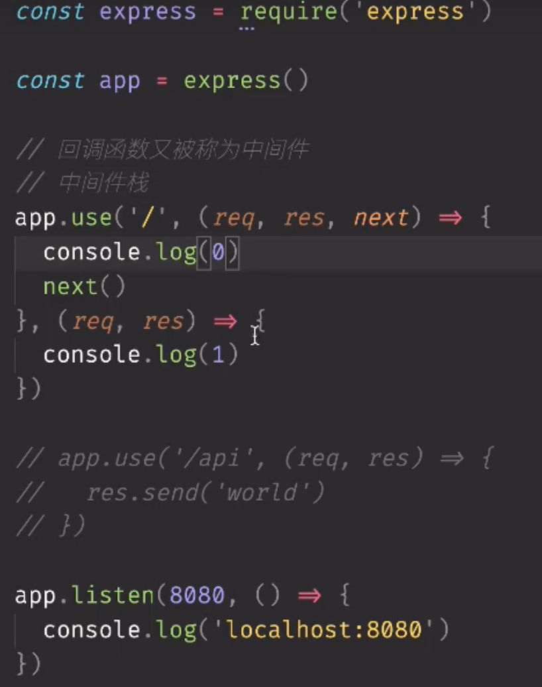

数组封装中间件

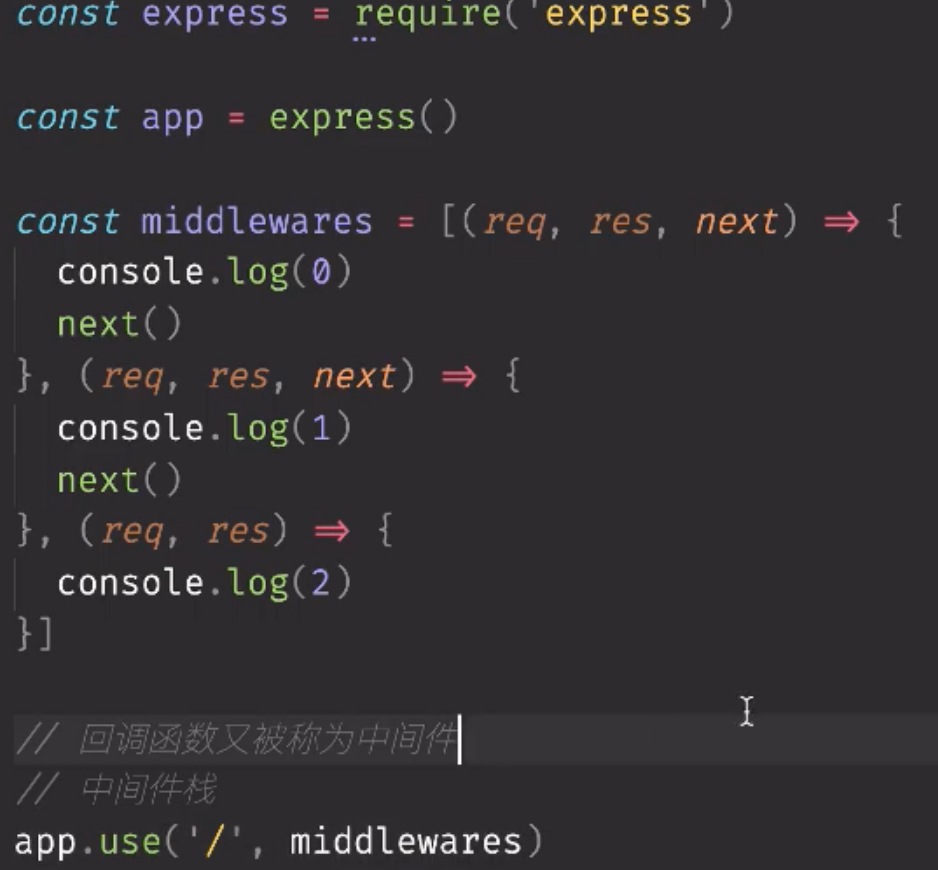


## 14.9 controller 与router分离

文件结构:

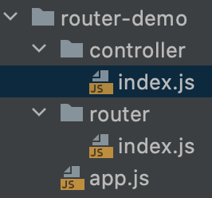

Controller/index.js:

```javascript
const list = (req, res, next) => {
    res.send('hello');
}

exports.list = list
```

Router/index.js:

```javascript
const express = require('express');
const router = express.Router();
const querystring = require('querystring');
const bodyParser = require('body-parser');
const { list } = require('../controller')

// 创建 application/x-www-form-urlencoded 编码解析
var urlencodedParser = bodyParser.urlencoded({ extended: false });

// 都是中间件
// 不过和use的中间件不一样，没有匹配优先顺序，匹配是谁就是谁
// 分离controller
router.get('/', list);

router.get('/index', (req, res, next) => {

    // 获取query对象
    let query = req.query;
    console.log(query);
    // 返回的事JSON
    // res.send(query);
    // 返回字符串呢?
    res.send(querystring.stringify(query));

});

// post 解析需要第三方中间件 body-parser, 用来解析node.js body的
router.post('/index', urlencodedParser, (req, res, next) => {
    let data = req.body;
    console.log(data);
    //console.log(data);
    res.send(data);
});

module.exports = router;
```

app.js

```javascript
const express = require('express');
const app = express();

// 调用写好的router
const router = require('./router/index');

const bodyParser = require('body-parser');


// 用这个接收post进来的json信息
app.use(bodyParser.json());

app.use('/', router)

let server = app.listen(8081, (req, res) => {
    console.log("8081");
})

```


## 14.10 Template

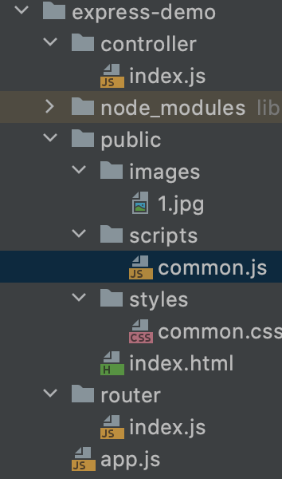

自带模板字符串实例：服务端渲染

```javascript
// index.js
const list = (req, res, next) => {
    let data = '<ul>';
    for(var i = 0; i < 100; i++) {
      // 模板字符串反引号！！！  
      data += `<li>line ${i} </li>`;
    }
    data += '</ul>';
    res.send(data);
}

exports.list = list
```

客户端渲染:

```javascript
// common.js
$.ajax({
    url: '/api/list',
    success(result) {
        let html = '<ul></ul>';
        $.each(result.data, (index, value) => {
            html += '<li>' + value + '</li>'
        })
        html += '</ul>';

        $('#list').html(html)
    }
})
```

```javascript
//index.js

const list = (req, res, next) => {
    // 客户端渲染 CSR
    // 后端只管给数据给前端
    // 发送对象给前端，会自动变成json
    let dataObj = {
        ret: true,
        data: []
    }
    for(var i = 0; i < 100; i++) {
       dataObj.data.push('line' + i)
    }
    res.send(dataObj);
}

exports.list = list
```


```html
// index.html
<!DOCTYPE html>
<html lang="en">
<head>
    <meta charset="UTF-8">
    <title>Title</title>
    <script src="https://apps.bdimg.com/libs/jquery/2.1.4/jquery.min.js"></script>
    <script src="./scripts/common.js"></script>
    <link rel="stylesheet" href="./styles/common.css">

</head>
<body>
<h1>index!!!!!</h1>
<a href="/api/list">获取list</a>
<div id="list"></div>
</body>
</html>
```


## 14. 11 Express静态资源托管

 引入express静态资源服务中间件

```javascript
// 静态资源服务中间件用这个引用express托管的静态资源
app.use(express.static('public'));
```


## 14.12 Express CRUD路由设计

| 请求方法    | 请求路径       | get参数 | post参数             | 备注             |
| ----------- | -------------- | ------- | -------------------- | ---------------- |
| GET         | /object        |         |                      | 渲染对象列表页面 |
| GET         | /object/new    |         |                      | 渲染添加对象页面 |
| POST        | /object        |         | name, age, gender... | 处理添加对象请求 |
| GET         | /object/edit   | id      |                      | 渲染对象编辑页面 |
| POST        | /object/edit   |         | Id,name,age...       | 处理对象编辑请求 |
| GET /DELETE | /object/remove | id      |                      | 处理对象删除请求 |


对于编辑：

```html
<a href="/object/edit?id={{object_id}}">Edit</a>
```

对于更新，对应的Id可以用一个隐藏的input, value放模板变量，来POST提交上去

```html
<input type="hidden" name="id" value="{{object.id}}">
```


# 15 MongoDB

## 15.1 安装驱动

```shell
cnpm install mongodb
```

## 15.2 创建数据库

要在 MongoDB 中创建一个数据库，首先我们需要创建一个 MongoClient 对象，然后配置好指定的 URL 和 端口号。

如果数据库不存在，MongoDB 将创建数据库并建立连接。

```javascript
var MongoClient = require('mongodb').MongoClient;
var url = "mongodb://localhost:27017/runoob";
 
MongoClient.connect(url, function(err, db) {
  if (err) throw err;
  console.log("数据库已创建!");
  db.close();
});
```

## 15.3 使用mogoose连接数据库

```javascript
// 启动服务
var mongoose = require('mongoose');
mongoose.connect('mongodb://localhost:27017/member', function (err) {
    if (err) {
        console.log(err, "数据库连接失败");
        return;
    }
    console.log('数据库连接成功');

    app.listen(port, function (err) {
        if (err) {
            console.error('err:', err);
        } else {
            console.info(`===> api server is running at localhost:27017`)
        }
    });
});
```

创建Schema

```javascript
var mongoose = require('mongoose');
var Schema = mongoose.Schema;

var MemberSchema = new Schema({
    name: String
})

module.exports = mongoose.model('Member', MemberSchema);

```

## 15.4 作业中用MongoDB

随时上网查语法


# 16 内置模块


## 16.1 URL

```javascript
const url = require('url');

const urlString = 'https://www.baidu.com:443/path/index.html?id=3';

// 解析出一个url对象
console.log(url.parse(urlString));
// 吧url对象，再解析成字符串
console.log(url.format( url.parse(urlString) ));

// 获取query参数
const urlParams = new URLSearchParams(url.parse(urlString).search));
console.log(urlParams.get('id'));

```

## 16.2 常用工具推荐

**推荐一个好用的日志记录包 log4js **

**=推荐postman的替代品，Insomnia**

如下还有其他常用工具

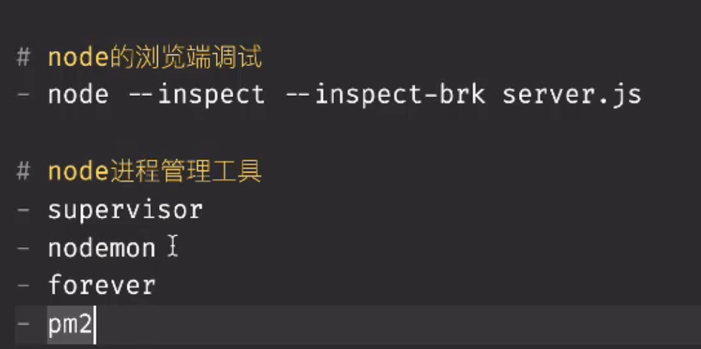

==以安装nodemon==

nodemon server.js

如果js文件发生修改，刷新页面就能看到改变 


## 16.2 querystring

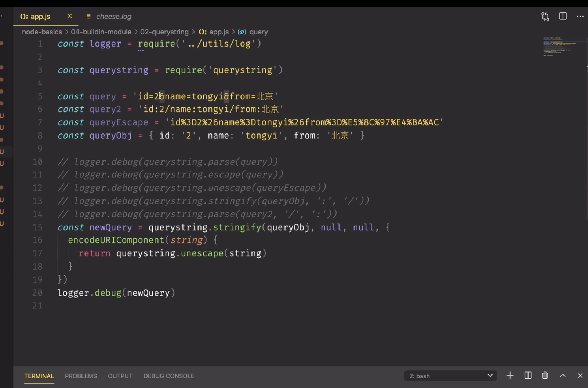

**来自url的请求实例**,把query转成json返回给客户端浏览器

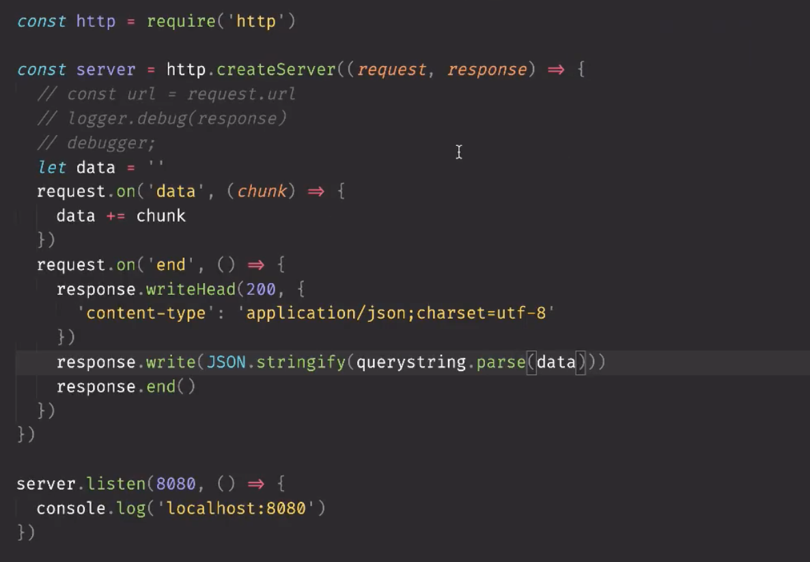

## 16.3 http

 解析纯文本类型， text/html可解析为html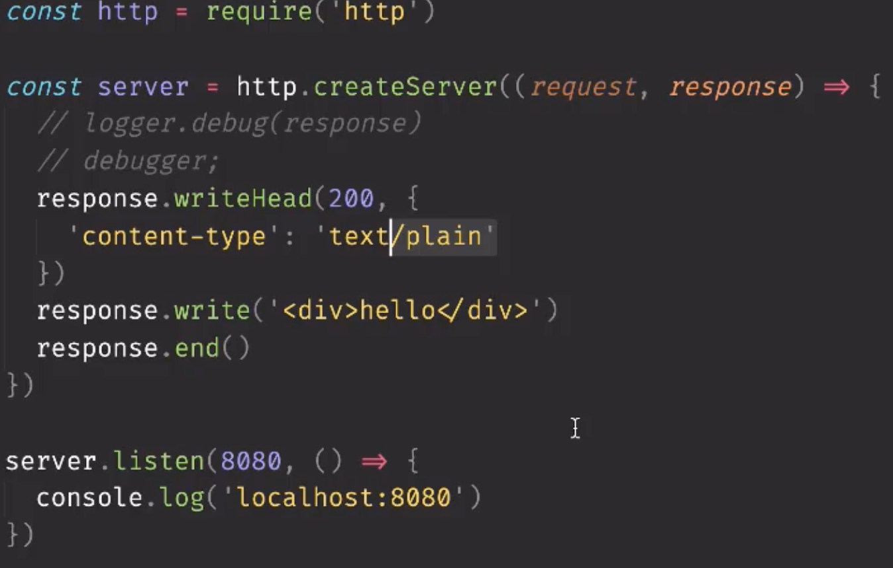

**Get 请求并返回结果**

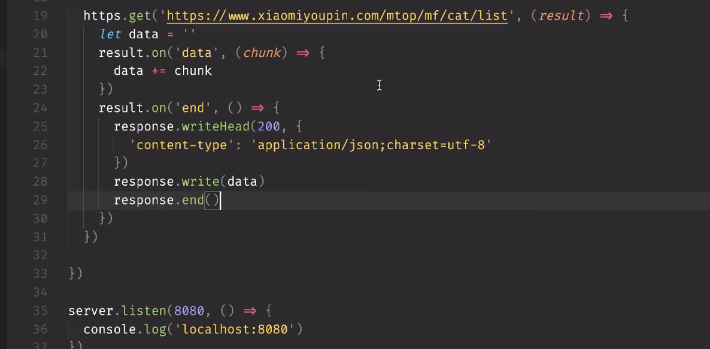

