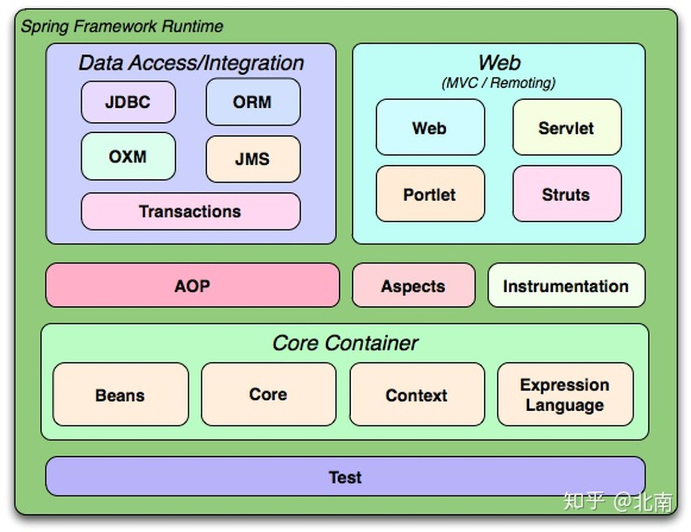
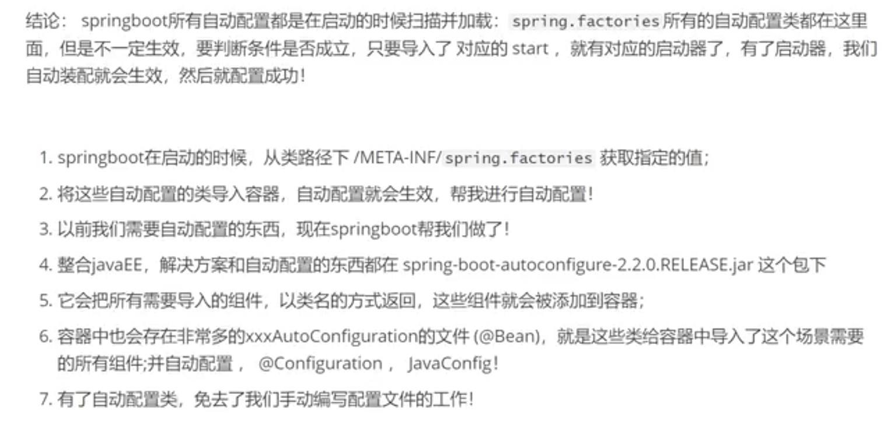

#  SpringBoot

Java SE: OOP
Mysql: data persistence

前端三大件

javaweb

ssm: 框架，比较复杂

Spring：



spring再简化：springboot; 微服务架构。


# 1. 什么事Spring

Spring是为了解决企业级应用开发的复杂性儿创建的，简化开发。

- 基于POJO的清凉型和小侵入型编程
- 通过IOC，依赖注入和面向接口实现松耦合
- AOP和惯例进行声明式编程
- 通过切面和模板减少样式代码

# 2. 什么事SpringBoot

自己搜

# 3. 微服务架构

把应用构建成一系列小服务的组合。

# 4.原理

## 4.1 自动装配

**pom.xml**

- Spring-boot-dependencies: 核心依赖在父工程中；
- 在写或者引入springboot依赖时不需要制定版本，因为有版本仓库；

**启动器**

```html
<dependency>
            <groupId>org.springframework.boot</groupId>
            <artifactId>spring-boot-starter-web</artifactId>
        </dependency>
```

启动器是springboot的启动场景，比如：spring-boot-starter-web，会自动导入web所需所有依赖。需要使用什么功能，只需要找到对应的启动器（官网上找）

**主函数**

```java
@SpringBootApplication
public class SpringbootLearnApplication {

    public static void main(String[] args) {
        SpringApplication.run(SpringbootLearnApplication.class, args);
    }

}
```




