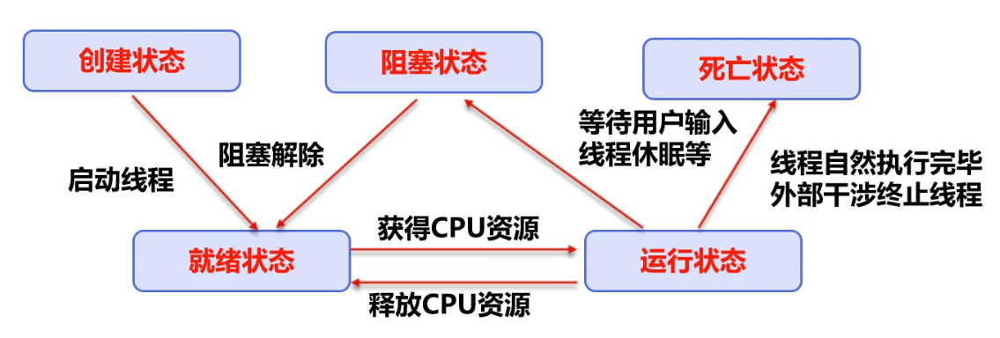
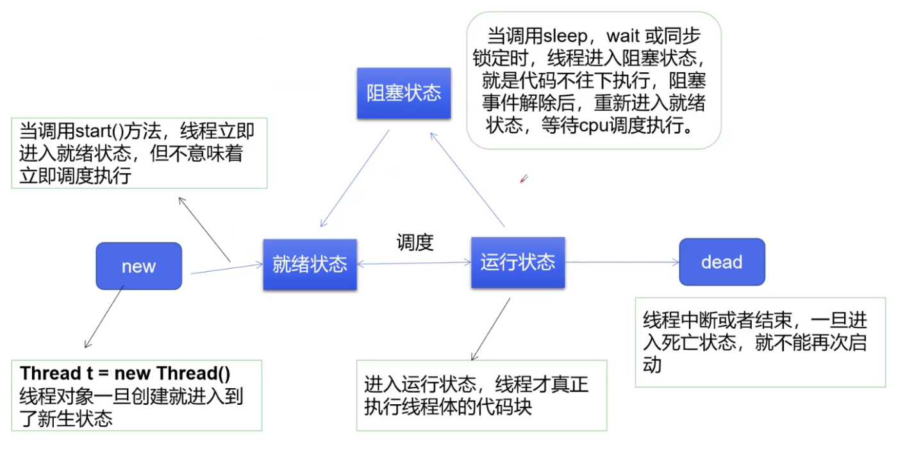
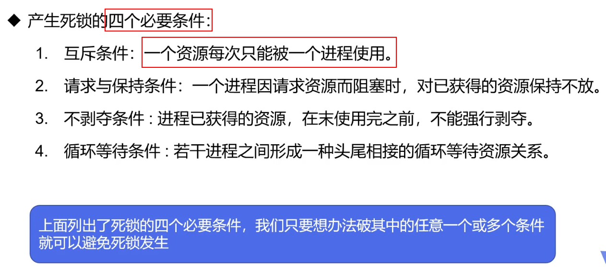
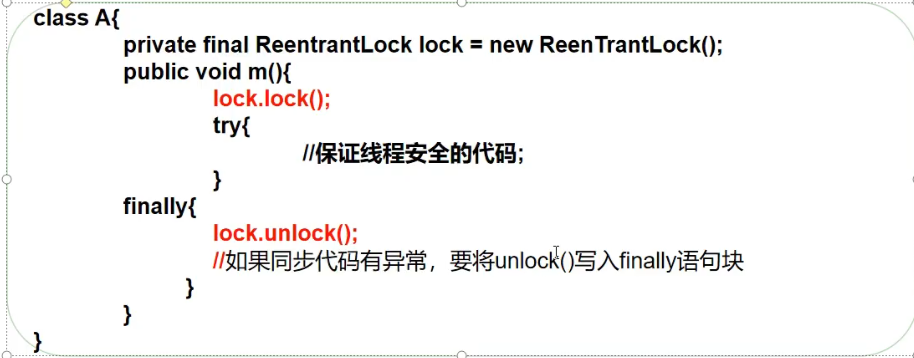

# 1、创建线程的两种方法

## 1、继承Thread类

```java
package com.draco.demo01;

/**
 * 创建线程方式1，继承Thread
 */
public class ThreadTest extends Thread{
    @Override
    public void run() {
        for (int i=0;i<20;i++){
            System.out.println("子线程启动"+i);
        }
    }

    public static void main(String[] args) {

        ThreadTest threadTest = new ThreadTest();
        threadTest.start();

        for (int i = 0; i < 200; i++) {
            System.out.println("主线程启动"+i);
        }
    }
}
```

## 2、实现Runnable接口

```java
package com.draco.demo01;

/**
 * 创建线程方式2，实现Runnable接口
 */
public class ThreadTest2 implements Runnable {
    @Override
    public void run() {
        for (int i=0;i<20;i++){
            System.out.println("子线程启动"+i);
        }
    }

    public static void main(String[] args) {

        ThreadTest2 threadTest2 = new ThreadTest2();
        new Thread(threadTest2).start();

        for (int i = 0; i < 200; i++) {
            System.out.println("主线程启动"+i);
        }
    }
}
```

> 推荐使用第二种，实现Runnable接口。

> 还有第三种Callable接口

## 3、下载网络图片

```java
package com.draco.demo01;

import org.apache.commons.io.FileUtils;

import java.io.File;
import java.io.IOException;
import java.net.URL;

public class Downloader implements Runnable {

    private String url;
    private String name;

    public Downloader(String url, String name) {
        this.url = url;
        this.name = name;
    }

    @Override
    public void run() {
        WebDownloader webDownloader = new WebDownloader();
        try {
            webDownloader.downloader(url,name);
            System.out.println("下载了文件名："+name);
        } catch (IOException e) {
            e.printStackTrace();
        }
    }

    public static void main(String[] args) {
        Downloader d1 = new Downloader("https://i0.hdslb.com/bfs/sycp/creative_img/202012/625fd761428be531b5405815ea33768b.jpg","第一个.jpg");
        Downloader d2 = new Downloader("https://i0.hdslb.com/bfs/sycp/creative_img/202102/d521778b3f50444d90e6fefc6719065c.jpg","第二个.jpg");
        Downloader d3 = new Downloader("https://i0.hdslb.com/bfs/activity-plat/static/20200714/953d0bfef678072bd11ec5fb6ff04190/nMOp2aGOf.png@400w_413h_1c_100q.webp","第三个.jpg");

        new Thread(d1).start();
        new Thread(d2).start();
        new Thread(d3).start();
    }
}

class WebDownloader{
    public void downloader(String url,String name) throws IOException {
        FileUtils.copyURLToFile(new URL(url),new File(name));
    }
}
```

## 4、小结

- 继承Thread类
  - 子类继承Thread类具有多线程能力
  - 启动线程：子类对象.start()
  - ==不建议使用，避免OOP单继承局限性==
- 实现Runnable接口
  - 实现接口Runnable具有多线程能力
  - 启动线程：传入目标对象+Thread对象.start()
  - ==推荐使用，避免单继承局限性，灵活方便，方便同一个对象被多个线程使用==


# 2、静态代理

```java
package com.draco.proxystatic;

/**
 * 静态代理
 */
public class Test {

    public static void main(String[] args) {
        You you = new You();
        WeddingCompany weddingCompany = new WeddingCompany(you);
        weddingCompany.marry();
    }

}

interface Marry{
    void marry();
}

//真实对象：结婚的人
class You implements Marry{

    @Override
    public void marry() {
        System.out.println("小明准备结婚了！");
    }
}

//代理对象：婚庆公司
class WeddingCompany implements Marry{

    private You you;

    public WeddingCompany(You you) {
        this.you = you;
    }

    @Override
    public void marry() {
        before();
        you.marry();
        after();
    }

    private void after() {
        System.out.println("婚庆公司在结婚之后，收钱~");
    }

    private void before() {
        System.out.println("婚庆公司在结婚之前，准备布置~");
    }
}
```

# 3、lambda

## 1、逐渐演进的版本

```java
package com.draco.lambda;

public class TestLambda1 {

    //3.静态内部类
    static class Like2 implements ILike{
        @Override
        public void like() {
            System.out.println("lambda like 2");
        }
    }

    public static void main(String[] args) {
        ILike like = new Like();
        like.like();

        like = new Like2();
        like.like();

        //4.局部内部类
        class Like3 implements ILike{
            @Override
            public void like() {
                System.out.println("lambda like 3");
            }
        }

        like = new Like3();
        like.like();

        //5.匿名内部类
        like = new ILike() {
            @Override
            public void like() {
                System.out.println("lambda like 4");
            }
        };
        like.like();

        //6.lambda表达式
        like = ()->{System.out.println("lambda like 5");};
        like.like();
    }

}

//1.定义一个函数式接口
interface ILike{
    void like();
}
//2.实现类
class Like implements ILike{

    @Override
    public void like() {
        System.out.println("lambda like 1");
    }
}
```

## 2、最终简化版

```java
package com.draco.lambda;

public class TestLambda2 {
    public static void main(String[] args) {
        ILove love = null;

        love = (a,name)->{
            System.out.println("a="+a);
            System.out.println("名字="+name);
        };

        love.love(12,"王菲");
    }
}

interface ILove{
    void love(int a,String name);
}
```

## 3、总结

- lambda表达式只能有一行代码的情况下，才能简化为一行，如果有多行，那么就用代码块包裹
- 前提接口是函数式接口，只有一个方法的接口
- 多个参数也可以去掉参数，要去掉就都去掉，而且必须加上括号

# 4、线程状态



详细



## 1、停止stop

```java
package com.draco.staticThread;

/**
 * 1、建议线程正常停止，利用次数，不建议死循环
 * 2、建议使用标志位，设置一个标志位
 * 3、不要使用stop或者destroy等过时或者JDK不建议使用的方法
 */
public class TestStop implements Runnable{

    private boolean flag = true;

    @Override
    public void run() {
        int i = 0;
        while (flag){
            System.out.println("run....Runnable Thread "+i++);
        }
    }

    public void over(){
        flag = false;
    }

    public static void main(String[] args) {

        TestStop testStop = new TestStop();
        new Thread(testStop).start();

        for (int i = 0; i < 1000; i++) {
            System.out.println("test main "+i);
            if(i==500){
                testStop.over();
                System.out.println("线程停止了");
            }
        }
    }
}
```

## 2、睡眠sleep

模拟网络延时

```java
package com.draco.staticThread;

/**
 * 模拟网络延时，放大问题的发生性
 */
public class TestSleep implements Runnable {

    private int tickteNum = 10;

    @Override
    public void run() {
        while (true){
            if(tickteNum<=0){
                break;
            }else {

                //模拟延时
                try {
                    Thread.sleep(100);
                } catch (InterruptedException e) {
                    e.printStackTrace();
                }

                System.out.println(Thread.currentThread().getName()+"得到了第 "+tickteNum--+" 票");
            }
        }
    }

    public static void main(String[] args) {
        TestSleep testSleep = new TestSleep();

        new Thread(testSleep,"小红").start();
        new Thread(testSleep,"小明").start();
        new Thread(testSleep,"小黄").start();
    }
}
```

倒计时，输出当前时间

```java
package com.draco.staticThread;

import java.text.SimpleDateFormat;
import java.util.Date;

/**
 * 模拟倒计时，获取当前系统时间
 */
public class TestSleep2 {
    public static void main(String[] args) throws InterruptedException {
        TestSleep2 testSleep2 = new TestSleep2();
        //testSleep2.tenDown();
        testSleep2.getTime();
    }
    public void tenDown() throws InterruptedException {
        int i = 10;
        while (true){
            if(i<=0){
                break;
            }else{
                Thread.sleep(1000);
                System.out.println(i--);
            }
        }
    }
    public void getTime() throws InterruptedException {
        Date startTime = new Date(System.currentTimeMillis());//获取当前系统时间
        while (true){
            Thread.sleep(1000);
            System.out.println(new SimpleDateFormat("HH:mm:ss").format(startTime));
            startTime = new Date(System.currentTimeMillis());//跟新当前时间
        }
    }
}
```

> 内个对象都有一把锁，sleep不会释放锁~

## 3、礼让yield

```java
package com.draco.staticThread;

public class TestYield {
    public static void main(String[] args) {
        MyYield myYield = new MyYield();

        new Thread(myYield,"小红").start();
        new Thread(myYield,"小名").start();
    }
}

class MyYield implements Runnable{

    @Override
    public void run() {
        System.out.println(Thread.currentThread().getName()+"线程在执行");
        Thread.yield();
        System.out.println(Thread.currentThread().getName()+"线程被暂停");
    }
}
```

> 礼让不一定成功，要看CPU的心情~
>
> 礼让线程，让当前正在执行的线程暂停，但不阻塞，将线程从运行状态转为就绪状态

## 4、合并Join

```java
package com.draco.staticThread;

public class TestJoin implements Runnable{
    @Override
    public void run() {
        for (int i = 0; i < 1000; i++) {
            System.out.println("线程VIP来了"+i);
        }
    }

    public static void main(String[] args) throws InterruptedException {
        TestJoin testJoin = new TestJoin();
        Thread thread = new Thread(testJoin);
        thread.start();

        for (int i = 0; i < 500; i++) {
            if(i==200){
                //插队
                thread.join();
            }
            System.out.println("main "+i);
        }
    }
}
```

> 也就是插队，待此线程执行完成后，再执行其他的线程，其他线程阻塞

## 5、线程的状态

```java
package com.draco.staticThread;

/**
 * 观察线程的状态
 */
public class TestState {

    public static void main(String[] args) throws InterruptedException {
        //使线程睡眠5秒
        Thread thread = new Thread(()->{
            for (int i = 0; i < 5; i++) {
                try {
                    Thread.sleep(1000);
                } catch (InterruptedException e) {
                    e.printStackTrace();
                }
            }
        });

        //观察状态
        Thread.State state = thread.getState();
        System.out.println(state);//NEW

        thread.start();
        state = thread.getState();
        System.out.println(state);//RUNNABLE

        while (state!=Thread.State.TERMINATED){
            state = thread.getState();
            Thread.sleep(100);
            System.out.println(state);//TERMINATED
        }

    }
}
```

> 当线程TERMINATED后（死亡后），就不能启动了，所以线程只能启动一次

## 6、线程的优先级

```java
package com.draco.priority;

public class TestPriority {
    public static void main(String[] args) {
        System.out.println(Thread.currentThread().getName()+"-->"+Thread.currentThread().getPriority());

        MyPriority myPriority = new MyPriority();
        Thread t1 = new Thread(myPriority);
        Thread t2 = new Thread(myPriority);
        Thread t3 = new Thread(myPriority);
        Thread t4 = new Thread(myPriority);
        Thread t5 = new Thread(myPriority);

        t1.setPriority(10);
        t1.start();

        t2.setPriority(5);
        t2.start();

        t3.setPriority(1);
        t3.start();

        t4.setPriority(8);
        t4.start();

        t5.setPriority(3);
        t5.start();
    }
}

class MyPriority implements Runnable{

    @Override
    public void run() {
        System.out.println(Thread.currentThread().getName()+"-->"+Thread.currentThread().getPriority());
    }
}
```

> 先设置优先级，再启动
>
> 优先级低的只是意味着获得CPU调度的概率低，并不是优先级底就不会被调用了

## 7、守护（daemon）线程

```java
package com.draco.daemon;

/**
 * 测试守护线程
 */
public class TestDaemon {
    public static void main(String[] args) {
        God god = new God();
        You you = new You();

        Thread thread = new Thread(god);
        thread.setDaemon(true);//变成守护线程，默认是false
        thread.start();

        new Thread(you).start();
    }
}

class God implements Runnable{

    @Override
    public void run() {
        while (true){
            System.out.println("上帝保佑着你");
        }
    }
}

class You implements Runnable{

    @Override
    public void run() {
        for (int i = 0; i < 365; i++) {
            System.out.println("-----开心的活着-----");
        }
        System.out.println("---goodBye world---");
    }
}
```

> 线程分为==用户线程==和==守护线程==
>
> - 虚拟机必须等到==用户线程==执行完毕【例如：main等】
> - 虚拟机不用等到==守护线程==执行完毕【例如：GC等】

# 5、线程同步

## 1、三大线程不安全案例

不安全的买票

```java
package com.draco.syn;

/**
 * 不安全的买票
 */
public class UnSafeBuyTicket {
    public static void main(String[] args) {
        BuyTicket buyTicket = new BuyTicket();

        new Thread(buyTicket,"小明").start();
        new Thread(buyTicket,"小红").start();
        new Thread(buyTicket,"黄牛党").start();
    }
}

class BuyTicket implements Runnable{
    private int ticketNums = 10;
    boolean flag = true;
    @Override
    public void run() {
        //买票
        while (flag){
            buy();
        }
    }

    public void buy(){
        if (ticketNums<=0){
            flag = false;
            return;
        }

        try {
            Thread.sleep(100);
        } catch (InterruptedException e) {
            e.printStackTrace();
        }

        System.out.println(Thread.currentThread().getName()+"-->"+ticketNums--);
    }
}
```

不安全的取钱

```java
package com.draco.syn;

public class UnSafeBank {
    public static void main(String[] args) {

        Account account = new Account(100,"理财基金");

        TakeMoney you = new TakeMoney(account,50,"你");
        TakeMoney girlFriend = new TakeMoney(account,100,"女朋友");

        you.start();
        girlFriend.start();

    }
}

//账户
class Account{
    int money;//余额
    String name;//卡名

    public Account(int money, String name) {
        this.money = money;
        this.name = name;
    }
}

//模拟取钱
class TakeMoney extends Thread{

    Account account;
    int takeMoney;
    int nowMoney;

    public TakeMoney(Account account, int takeMoney, String name) {
        super(name);
        this.account = account;
        this.takeMoney = takeMoney;
    }

    @Override
    public void run() {
        //判断有没有钱
        if(account.money-this.takeMoney<0){
            System.out.println("账户余额不足~，还剩 "+account.money);
            return;
        }

        try {
            Thread.sleep(1000);
        } catch (InterruptedException e) {
            e.printStackTrace();
        }

        account.money = account.money - takeMoney;
        nowMoney = nowMoney + takeMoney;
        System.out.println(account.name+"-->"+"账户余额："+account.money);
        System.out.println(this.getName()+"-->"+"手里钱："+nowMoney);
    }
}
```

不安全的集合

```java
package com.draco.syn;

import java.util.ArrayList;

/**
 * 不安全的集合
 */
public class UnSafeList {
    public static void main(String[] args) throws InterruptedException {
        ArrayList<String> list = new ArrayList<>();
        for (int i = 0; i < 10000; i++) {
            new Thread(()->{
                list.add(Thread.currentThread().getName());
            }).start();
        }

        Thread.sleep(10);

        System.out.println("list's size = "+list.size());
    }
}
```

## 2、synchronize同步

对于上述三种线程不安全的案例解决方案

```java
package com.draco.syn;

/**
 * 不安全的买票
 */
public class UnSafeBuyTicket {
    public static void main(String[] args) {
        BuyTicket buyTicket = new BuyTicket();

        new Thread(buyTicket,"小明").start();
        new Thread(buyTicket,"小红").start();
        new Thread(buyTicket,"黄牛党").start();
    }
}

class BuyTicket implements Runnable{
    private int ticketNums = 10;
    boolean flag = true;
    @Override
    public void run() {
        //买票
        while (flag){

            try {
                Thread.sleep(100);
            } catch (InterruptedException e) {
                e.printStackTrace();
            }

            buy();
        }
    }

    //synchronized，同步方法，锁的是this
    public synchronized void buy(){
        if (ticketNums<=0){
            flag = false;
            return;
        }

        System.out.println(Thread.currentThread().getName()+"-->"+ticketNums--);
    }
}
```


```java
package com.draco.syn;

public class UnSafeBank {
    public static void main(String[] args) {

        Account account = new Account(100,"理财基金");

        TakeMoney you = new TakeMoney(account,50,"你");
        TakeMoney girlFriend = new TakeMoney(account,100,"女朋友");

        you.start();
        girlFriend.start();

    }
}

//账户
class Account{
    int money;//余额
    String name;//卡名

    public Account(int money, String name) {
        this.money = money;
        this.name = name;
    }
}

//模拟取钱
class TakeMoney extends Thread{

    Account account;
    int takeMoney;
    int nowMoney;

    public TakeMoney(Account account, int takeMoney, String name) {
        super(name);
        this.account = account;
        this.takeMoney = takeMoney;
    }

    @Override
    public void run() {

        //锁住account，因为account在增加减少【锁住变化的量】
        synchronized(account){
            //判断有没有钱
            if(account.money-this.takeMoney<0){
                System.out.println("账户余额不足~，还剩 "+account.money);
                return;
            }

            try {
                Thread.sleep(1000);
            } catch (InterruptedException e) {
                e.printStackTrace();
            }

            account.money = account.money - takeMoney;
            nowMoney = nowMoney + takeMoney;
            System.out.println(account.name+"-->"+"账户余额："+account.money);
            System.out.println(this.getName()+"-->"+"手里钱："+nowMoney);
        }


    }
}
```


```java
package com.draco.syn;

import java.util.ArrayList;

/**
 * 不安全的集合
 */
public class UnSafeList {
    public static void main(String[] args) throws InterruptedException {
        ArrayList<String> list = new ArrayList<>();
        for (int i = 0; i < 10000; i++) {
            new Thread(()->{
                synchronized (list){
                    list.add(Thread.currentThread().getName());
                }
            }).start();
        }

        Thread.sleep(10);

        System.out.println("list's size = "+list.size());
    }
}
```

> 记住：对于synchronized的对象就是我们需要==修改的对象==即可

# 6、锁

## 1、死锁

```java
package com.draco.lock;

public class DeadLock {
    public static void main(String[] args) {
        Makeup g1 = new Makeup(0,"小红");
        Makeup g2 = new Makeup(1,"小明明");

        g1.start();
        g2.start();
    }
}

class LipStick{}
class Mirror{}

class Makeup extends Thread{

    //需要一份资源，用static来保证只有一份资源
    static LipStick lipStick = new LipStick();
    static Mirror mirror = new Mirror();

    private int choice;
    private String girlName;

    public Makeup(int choice,String girlName){
        this.choice = choice;
        this.girlName = girlName;
    }

    @Override
    public void run() {
        makeup();
    }

    private void makeup() {
        if(choice==0){
            //不要同时抱一把锁就好了
            synchronized (lipStick){
                System.out.println(this.girlName+"获得口红");
//                synchronized (mirror){
//                    System.out.println(this.girlName+"获得镜子");
//                }
            }
            synchronized (mirror){
                System.out.println(this.girlName+"获得镜子");
            }
        }else{
            synchronized (mirror){
                System.out.println(this.girlName+"获得镜子");
//                synchronized (lipStick){
//                    System.out.println(this.girlName+"获得口红");
//                }
            }
            synchronized (lipStick){
                System.out.println(this.girlName+"获得口红");
            }
        }
    }
}
```

## 2、死锁产生的必要条件



## 3、ReentrantLock可重入锁

```java
package com.draco.lock;

import java.util.concurrent.locks.ReentrantLock;

public class TestReentrantLock {
    public static void main(String[] args) {
        Lock2 lock2 = new Lock2();

        new Thread(lock2).start();
        new Thread(lock2).start();
    }
}

class Lock2 implements Runnable{
    private int ticketNums = 10;

    private final ReentrantLock reentrantLock = new ReentrantLock();

    @Override
    public void run() {
        while (true){
            try{
                //加锁
                reentrantLock.lock();
                if(ticketNums<=0){
                    break;
                }else{
                    try {
                        Thread.sleep(1000);
                    } catch (InterruptedException e) {
                        e.printStackTrace();
                    }
                    System.out.println(ticketNums--);
                }
            }
            finally {
                //解锁
                reentrantLock.unlock();
            }


        }
    }
}
```



# 7、线程通信

## 1、管程法

```java
package com.draco.gaoji;

/**
 *
 */
public class TestPC {
    public static void main(String[] args) {
        KeepSpace keepSpace = new KeepSpace();

        new Thread(new Producer(keepSpace)).start();
        new Thread(new Customer(keepSpace)).start();

    }

}

class Food{
    int id;
    public Food(int id) {
        this.id = id;
    }
}

class Producer implements Runnable{

    KeepSpace keepSpace;

    public Producer(KeepSpace keepSpace) {
        this.keepSpace = keepSpace;
    }

    @Override
    public void run() {
        for (int i = 0; i < 100; i++) {
            keepSpace.push(new Food(i));
            System.out.println("生产了第"+i+"个食物");
        }
    }
}

class Customer implements Runnable{

    KeepSpace keepSpace;

    public Customer(KeepSpace keepSpace) {
        this.keepSpace = keepSpace;
    }

    @Override
    public void run() {
        //消费者消费
        for (int i = 0; i < 100; i++) {
            System.out.println("消费了第"+keepSpace.pop().id+"个食物");
        }
    }
}

class KeepSpace{
    //空间大小
    Food[] foods = new Food[10];
    //空间计数器
    int count = 0;

    public synchronized void push(Food food){
        //空间满了，等待消费者消费
        if (count==foods.length){
            //通知消费者消费
            try {
                this.wait();
            } catch (InterruptedException e) {
                e.printStackTrace();
            }
        }

        //空间没有满，继续制作
        foods[count] = food;
        count++;
        //有吃的，可以通知消费者消费了
        this.notifyAll();
    }

    //消费者消费
    public synchronized Food pop(){
        //判断能否消费
        if (count==0){
            //等待生产者生产
            try {
                this.wait();
            } catch (InterruptedException e) {
                e.printStackTrace();
            }
        }
        count--;
        Food food = foods[count];
        //吃完了，通知生产者生产
        this.notifyAll();
        return food;
    }
}
```

## 2、信号灯法

